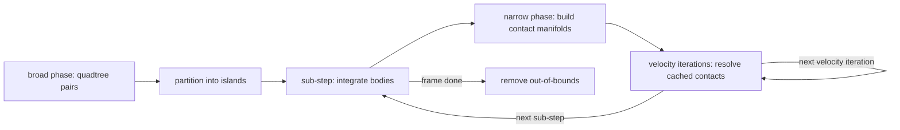

# bocphysics

A 2D rigid-body physics engine written in Python on top of
[`bocpy`](https://pypi.org/project/bocpy/), a library for **Behavior-Oriented
Concurrency (BOC)**. The project doubles as a teaching aid for learning to
program with BOC: the source is written to be read, so readability sits alongside
correctness as a first-class concern.

> **Status: work in progress.** The engine runs and renders, and we are
> actively reshaping the internals. A BOC worker solver now runs each frame in
> parallel as an opt-in (`--parallel`), cutting the world into equal-population
> vertical slabs; the serial engine remains the default. Expect APIs, scenes,
> and numbers in this README to move as the work lands.

## What it does

- Convex-polygon and circle rigid bodies with mass, inertia, and friction.
- A posteriori collision handling: integrate, detect, then resolve with
  impulses. The default solver separates a few sub-steps (which integrate and
  re-detect, limiting tunnelling) from several velocity iterations per sub-step
  (which converge the cached contacts, giving stable stacks).
- Broad-phase detection via a quadtree spatial index (or a brute-force scan).
- An opt-in BOC worker solver (`--parallel`) that cuts the world into
  equal-population vertical slabs and fans each slab's solve across workers.
- Declarative, picklable scene specifications (`bocphysics.scene`).
- An interactive pyglet front-end and a headless benchmark.

## Quick start

```bash
source .env314/bin/activate
pip install -e .[test]       # editable install with test deps
simulation                   # run the interactive simulation
```

Useful flags: `--scene open_box`, `--mode friction`, `--detect quadtree`,
`--debug`, `--show-contacts`. Left-click spawns a circle, right-click spawns a
polygon, space pauses.

Built-in scenes mirror the benchmark layouts so they can be eyeballed directly:
`--scene stack` (a settling column), `--scene pyramid` (the torque-prone brick
pyramid), `--scene golden` (the deterministic golden-master scatter), and
`--scene open_box` (an empty box to click shapes into). Add `--parallel` to view
any of them under the BOC worker solver, which cuts the world into
equal-population vertical slabs and fans each slab's solve across workers.

## The per-frame step

Each frame builds the broad phase and island partition once, then solves each
island independently. The default solver splits each island's work into a few
**sub-steps** and several **velocity iterations**. A sub-step integrates the
dynamic bodies and builds every pair's contact manifold once (the narrow
phase); the velocity iterations then reuse those cached manifolds to converge
the coupled contacts without paying the narrow-phase cost again. Out-of-bounds
bodies are pruned at the end of the frame.



## Benchmark

[`bench/drop_box.py`](bench/drop_box.py) is a headless perf and convergence
probe. It **streams** a mix of circles and polygons into an open box over the
course of the run, steps the engine without a window, and reports wall-clock
cost per frame plus two convergence proxies: total **kinetic energy** (should
decay toward rest) and total **penetration depth** (should stay bounded). The
spawn placement draws from Python's `random` without a fixed seed, so numbers
vary run to run; treat the table below as a trend, not a contract.

Streaming the drops (rather than releasing one clump) takes the scene through
distinct stages — scattered singletons, then several separate piles, then one
merged pile — which is what exercises the collision **islands** the engine
resolves independently.

```bash
python bench/drop_box.py --shapes 80 --frames 300
python bench/drop_box.py --shapes 80 --frames 300 --snapshot 40,150,300
python bench/drop_box.py --shapes 80 --frames 300 --video drop_box.mp4
python bench/drop_box.py --shapes 80 --frames 300 --parallel --workers 8
```

Add `--parallel` to solve each frame across BOC workers. The parallel run cuts
the world into equal-population vertical slabs by default; pass `--quadtree-cut`
to benchmark the loose-quadtree fallback or `--slabs N` to set the slab count.

### Baseline (80 shapes, 300 frames, friction, quadtree)

Averaged over five runs, reported as mean ± one standard deviation; unseedable
spawns mean these are a trend, not a contract.

| Frame | ms/frame | Kinetic energy | Penetration |
|------:|---------:|---------------:|------------:|
|    30 |   0.22 ± 0.10 |     306.81 ± 26.06 |  2.0000 ± 0.0000 |
|    60 |   0.73 ± 0.11 |    2175.21 ± 89.01 |  2.0000 ± 0.0000 |
|    90 |   1.34 ± 0.30 |    7272.18 ± 179.91 |  2.1597 ± 0.2186 |
|   120 |   1.63 ± 0.24 |   15100.79 ± 1293.80 |  2.0000 ± 0.0000 |
|   150 |   2.24 ± 0.30 |   13636.04 ± 1002.83 |  2.0134 ± 0.0290 |
|   180 |   4.18 ± 0.09 |   10370.42 ± 851.43 |  2.0342 ± 0.0504 |
|   210 |   8.90 ± 1.20 |    7650.30 ± 1695.14 |  2.0807 ± 0.0385 |
|   240 |  15.68 ± 1.24 |    6596.73 ± 1681.94 |  2.2137 ± 0.0820 |
|   270 |  22.71 ± 2.65 |    2294.60 ± 572.75 |  2.5240 ± 0.0703 |
|   300 |  29.30 ± 2.42 |     249.32 ± 73.20 |  2.4086 ± 0.0704 |

Mean 8.7 ± 0.4 ms/frame over the five runs, with the substep solver that
separates sub-steps from velocity iterations. These numbers are higher than
earlier revisions of this table because the default velocity-iteration count
rose from 5 to 10 per sub-step, trading per-frame cost for tighter contact
convergence. Cost climbs steadily as bodies accumulate and islands merge;
kinetic energy peaks mid-run while shapes are still falling, then collapses as
the pile settles. Penetration stays bounded near 2 throughout — the behaviour
we want from the contact solver.

### Parallel (slab cut, 8 workers)

The same scene under `--parallel --workers 8`, which cuts the world into
equal-population vertical slabs and fans each slab's solve across BOC workers.
Averaged over five runs, mean ± one standard deviation; same unseedable spawns,
so treat it as a trend.

| Frame | ms/frame | Kinetic energy | Penetration |
|------:|---------:|---------------:|------------:|
|    30 |   0.63 ± 0.14 |     306.36 ± 26.87 |  2.0000 ± 0.0000 |
|    60 |   1.53 ± 0.04 |    2173.06 ± 91.38 |  2.0000 ± 0.0000 |
|    90 |   2.02 ± 0.14 |    7281.24 ± 177.86 |  2.0971 ± 0.1330 |
|   120 |   2.14 ± 0.23 |   15108.60 ± 1295.76 |  2.0000 ± 0.0000 |
|   150 |   2.48 ± 0.21 |   13546.62 ± 931.44 |  2.0054 ± 0.0090 |
|   180 |   3.54 ± 0.29 |   10219.06 ± 934.89 |  2.0552 ± 0.0401 |
|   210 |   5.33 ± 0.16 |    7881.64 ± 1458.67 |  2.2432 ± 0.1091 |
|   240 |   6.66 ± 1.00 |    6280.22 ± 1657.80 |  2.6335 ± 0.1314 |
|   270 |   7.90 ± 0.48 |    2483.96 ± 653.92 |  3.3139 ± 0.2095 |
|   300 |   8.72 ± 0.28 |     339.24 ± 92.44 |  3.3469 ± 0.2216 |

Mean 4.1 ± 0.1 ms/frame over the five runs — roughly 2.1x the serial baseline
overall, and ~3.4x at the dense final frame (29.3 → 8.7 ms) where there is the
most independent work to fan out. The slab decomposition settles slightly
looser than the serial sweep: penetration drifts toward ~3 late in the run
rather than holding near 2, the expected order-of-resolution trade-off for
splitting one island's contacts across workers.

### Snapshots

The benchmark can render selected frames through a pyglet window with
`--snapshot`, or encode the whole run to an mp4 with `--video` (needs ffmpeg).
Below, three stages of the streamed drop: a few early bodies, several distinct
piles, and the final merged pile.

| Frame 40 (singletons) | Frame 150 (distinct islands) | Frame 300 (settled) |
|:---:|:---:|:---:|
|  |  |  |

## License

See [LICENSE](LICENSE).
