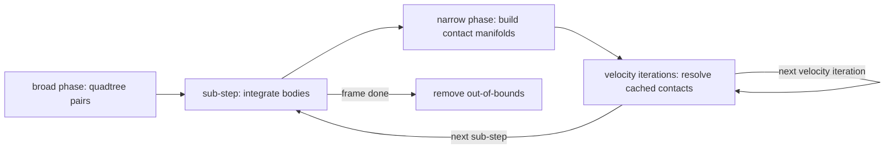
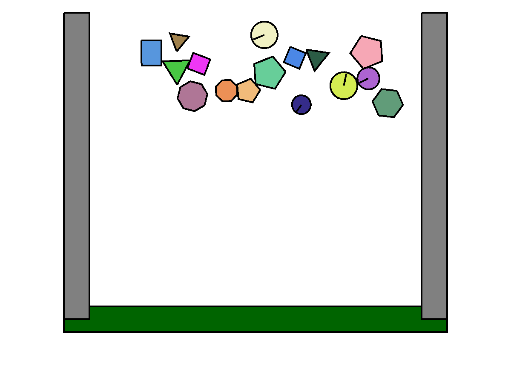
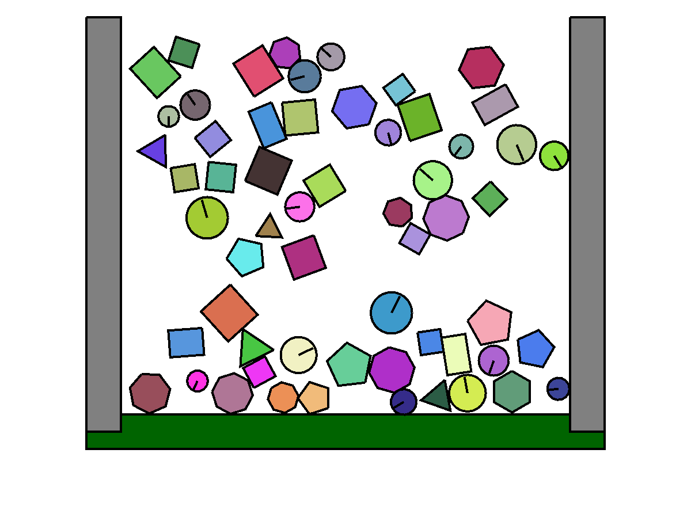
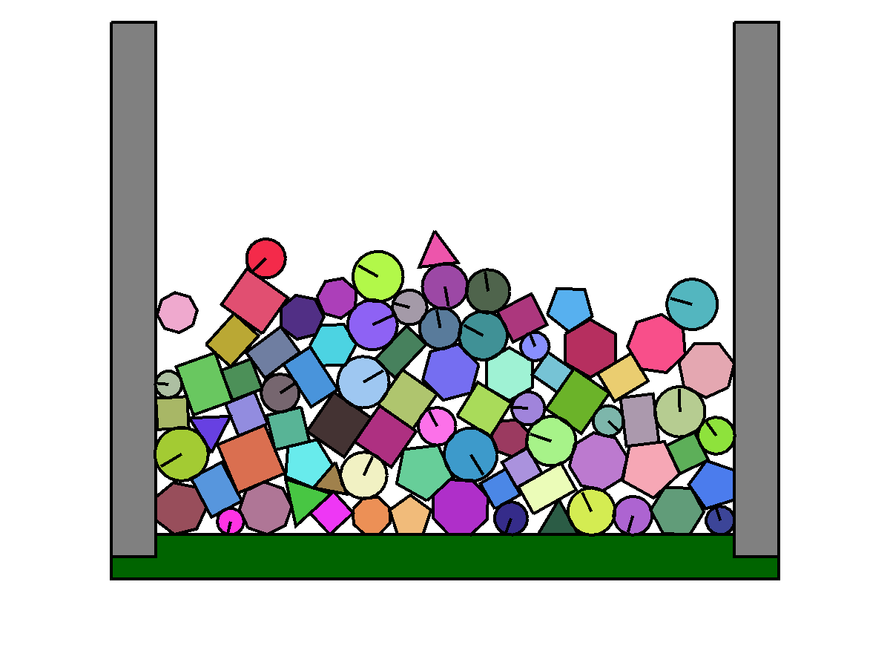

# bocphysics

A 2D rigid-body physics engine written in Python on top of
[`bocpy`](https://pypi.org/project/bocpy/), a library for **Behavior-Oriented
Concurrency (BOC)**. The project doubles as a teaching aid for learning to
program with BOC: the source is written to be read, so readability sits alongside
correctness as a first-class concern.

## What it does

- Convex-polygon and circle rigid bodies with mass, inertia, and friction.
- A posteriori collision handling: integrate, detect, then resolve with
  impulses. The default solver separates a few sub-steps (which integrate and
  re-detect, limiting tunnelling) from several velocity iterations per sub-step
  (which converge the cached contacts, giving stable stacks).
- Broad-phase detection via a quadtree spatial index (or a brute-force scan).
- An opt-in BOC worker solver (`--parallel`) that cuts the world into
  equal-population vertical slabs and fans each slab's solve across workers.
- Declarative, picklable scene specifications (`bocphysics.scene`).
- An interactive pyglet front-end and a headless benchmark.

## Install

bocphysics requires **Python 3.12 or newer** (the parallel solver uses
per-worker sub-interpreters, which are only truly parallel on 3.12+).

Install the released package from PyPI:

```bash
pip install bocphysics
```

Or install from a clone of this repository — add the `test` extra to run the
suite:

```bash
git clone https://github.com/matajoh/boc-physics.git
cd boc-physics
pip install -e .[test]
```

The interactive front-end opens a window via [pyglet](https://pyglet.org), so
it needs a display. The headless [benchmark](#benchmark) runs without one.

## Run the simulation

The install adds a `simulation` console script:

```bash
simulation                       # the default interactive arena
simulation --scene open_box      # an open box to click shapes into
simulation --parallel --debug    # the default arena on BOC workers, with the debug overlay
```

### Controls

| Input | Action |
|-------|--------|
| Left-click | Spawn a circle at the cursor |
| Right-click | Spawn a polygon at the cursor |
| Space | Pause / resume the simulation |
| Escape | Close the window |

## Scenes

Pick a built-in scene with `--scene`, or pass a path to a scene JSON file
(see [`bocphysics.scene`](src/bocphysics/scene.py)). The built-ins are:

| Scene | What it is |
|-------|------------|
| `default` | A floor and two angled ledges — the interactive sandbox. |
| `open_box` | An open-topped box to click or stream shapes into. |
| `stack` | A settling vertical column of boxes. |
| `pyramid` | The torque-prone brick pyramid (a stability stress test). |
| `golden` | The deterministic seeded scatter the golden-master test settles. |

The `stack` and `pyramid` scenes are parametric: `--levels N` sets their row
count, e.g. `simulation --scene pyramid --levels 6`.

## Command-line options

| Flag | Values (default) | Purpose |
|------|------------------|---------|
| `--scene` | name or JSON path (`default`) | Choose the arena. |
| `--levels` | int (auto) | Row count for `stack` / `pyramid`. |
| `--mode`, `-m` | `basic`, `friction`, `none`, `rotation` (`friction`) | Physics response model. |
| `--detect` | `quadtree`, `basic` (`quadtree`) | Broad-phase algorithm. |
| `--parallel` | flag | Solve each frame across BOC worker sub-interpreters. |
| `--workers` | int (auto) | Worker count when `--parallel` is set. |
| `--size`, `-s` | `WxH` (`1200x900`) | Window size. |
| `--show-contacts` | flag | Draw contact points. |
| `--debug`, `-d` | flag | Overlay debug information. |

Add `--parallel` to any scene to watch the BOC worker solver, which cuts the
world into equal-population vertical slabs and fans each slab's solve across
workers.

## The per-frame step

Each frame builds the broad phase once, then solves all dynamic bodies and
their candidate pairs together as a single group. The default solver splits the
work into a few **sub-steps** and several **velocity iterations**. A sub-step
integrates the dynamic bodies and builds every pair's contact manifold once
(the narrow phase); the velocity iterations then reuse those cached manifolds
to converge the coupled contacts without paying the narrow-phase cost again.
Out-of-bounds bodies are pruned at the end of the frame.



## Benchmark

[`bench/drop_box.py`](bench/drop_box.py) is a headless perf and convergence
probe. It **streams** a mix of circles and polygons into an open box over the
course of the run, steps the engine without a window, and reports wall-clock
cost per frame plus two convergence proxies: total **kinetic energy** (should
decay toward rest) and total **penetration depth** (should stay bounded). Spawn
placement is drawn from a seeded Matrix PRNG (`--seed`, default 0): each of the
five runs uses a different but deterministic seed, so the runs genuinely differ
yet the whole sweep reproduces exactly. Timing still depends on the machine and
load, so treat the tables below as a trend, not a contract — they were captured
on an Intel Core i7-14700F (28 logical cores) with turbo boost disabled for
stable timing, under Linux, on CPython 3.14.4 with bocpy 0.13.0.

Streaming the drops (rather than releasing one clump) takes the scene through
distinct stages — scattered singletons, then several separate piles, then one
merged pile — which is what exercises the collision **islands** the engine
resolves independently.

```bash
python bench/drop_box.py --shapes 80 --frames 300
python bench/drop_box.py --shapes 80 --frames 300 --batched
python bench/drop_box.py --shapes 80 --frames 300 --snapshot 40,150,300
python bench/drop_box.py --shapes 80 --frames 300 --video drop_box.mp4
python bench/drop_box.py --shapes 80 --frames 300 --parallel --workers 8
```

Add `--parallel` to solve each frame across BOC workers. The parallel run cuts
the world into equal-population vertical slabs by default; pass `--quadtree-cut`
to benchmark the loose-quadtree fallback or `--slabs N` to set the slab count.
Add `--batched` (serial or parallel) to swap the per-contact Python loop for the
colour-batched velocity kernel.

### Baseline (80 shapes, 300 frames, friction, quadtree)

Averaged over five runs, reported as mean ± one standard deviation.

| Frame | ms/frame | Kinetic energy | Penetration |
|------:|---------:|---------------:|------------:|
|    30 |   0.18 ± 0.09 |     306.81 ± 26.06 |  2.0000 ± 0.0000 |
|    60 |   0.63 ± 0.10 |    2175.21 ± 89.01 |  2.0000 ± 0.0000 |
|    90 |   1.21 ± 0.31 |    7272.18 ± 179.91 |  2.1597 ± 0.2186 |
|   120 |   1.45 ± 0.20 |   15100.79 ± 1293.80 |  2.0000 ± 0.0000 |
|   150 |   2.01 ± 0.19 |   13636.04 ± 1002.83 |  2.0134 ± 0.0290 |
|   180 |   3.94 ± 0.13 |   10370.42 ± 851.43 |  2.0342 ± 0.0504 |
|   210 |   8.17 ± 1.01 |    7650.30 ± 1695.14 |  2.0807 ± 0.0385 |
|   240 |  14.39 ± 1.31 |    6596.73 ± 1681.94 |  2.2137 ± 0.0820 |
|   270 |  20.61 ± 2.73 |    2294.60 ± 572.75 |  2.5240 ± 0.0703 |
|   300 |  25.93 ± 2.17 |     249.32 ± 73.20 |  2.4086 ± 0.0704 |

Mean 7.9 ± 0.5 ms/frame over the five runs, with the substep solver that
separates sub-steps from velocity iterations. Cost climbs steadily as bodies
accumulate and islands merge; kinetic energy peaks mid-run while shapes are
still falling, then collapses as the pile settles. Penetration stays bounded
near 2 throughout — the behaviour we want from the contact solver.

### Parallel (slab cut, 8 workers)

The same scene under `--parallel --workers 8`, which cuts the world into
equal-population vertical slabs and fans each slab's solve across BOC workers.
Averaged over five runs, mean ± one standard deviation (the same seeded sweep as
the baseline).

| Frame | ms/frame | Kinetic energy | Penetration |
|------:|---------:|---------------:|------------:|
|    30 |   0.73 ± 0.16 |     306.36 ± 26.87 |  2.0000 ± 0.0000 |
|    60 |   1.66 ± 0.09 |    2173.06 ± 91.38 |  2.0000 ± 0.0000 |
|    90 |   2.24 ± 0.18 |    7281.24 ± 177.86 |  2.0971 ± 0.1330 |
|   120 |   2.44 ± 0.33 |   15108.60 ± 1295.76 |  2.0000 ± 0.0000 |
|   150 |   2.87 ± 0.48 |   13546.62 ± 931.44 |  2.0054 ± 0.0090 |
|   180 |   4.09 ± 0.68 |   10219.06 ± 934.89 |  2.0552 ± 0.0401 |
|   210 |   5.84 ± 0.43 |    7887.23 ± 1493.26 |  2.2409 ± 0.1081 |
|   240 |   6.80 ± 1.01 |    6190.65 ± 1865.09 |  2.5321 ± 0.0573 |
|   270 |   8.43 ± 0.45 |    2629.97 ± 714.19 |  3.1137 ± 0.1779 |
|   300 |   9.51 ± 0.73 |     394.28 ± 115.58 |  3.4338 ± 0.7303 |

Mean 4.5 ± 0.3 ms/frame over the five runs — roughly 1.8x the serial baseline
overall, and ~2.7x at the dense final frame (25.9 → 9.5 ms) where there is the
most independent work to fan out. The slab decomposition settles slightly
looser than the serial sweep: penetration drifts toward ~3 late in the run
rather than holding near 2, the expected order-of-resolution trade-off for
splitting one island's contacts across workers.

### Snapshots

The benchmark can render selected frames through a pyglet window with
`--snapshot`, or encode the whole run to an mp4 with `--video` (needs ffmpeg).
Below, three stages of the streamed drop: a few early bodies, several distinct
piles, and the final merged pile.

| Frame 40 (singletons) | Frame 150 (distinct islands) | Frame 300 (settled) |
|:---:|:---:|:---:|
|  |  |  |

## Documentation

bocphysics is built on [`bocpy`](https://pypi.org/project/bocpy/), a library
for **Behavior-Oriented Concurrency**: data lives inside *cowns* and code runs
as *behaviors* that the scheduler dispatches once the cowns they need are
available, eliminating data races and deadlocks by construction.

A full tutorial — rigid-body physics, the engine's Gauss-Seidel solver, and the
step-by-step conversion to a parallel BOC solver — along with a Sphinx API
reference is in development under `docs/`.

## Development

```bash
pip install -e .[test,lint]
pytest                 # run the test suite
flake8 src test bench scripts
```

## License

See [LICENSE](LICENSE).
