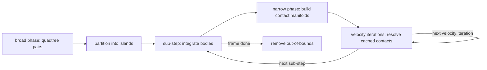

# bocphysics

A 2D rigid-body physics engine written in Python on top of
[`bocpy`](https://pypi.org/project/bocpy/), a library for **Behavior-Oriented
Concurrency (BOC)**. The project doubles as a teaching aid for the Cambridge
4M26 Tripos: the source is written to be read, so readability sits alongside
correctness as a first-class concern.

> **Status: work in progress.** The engine runs and renders, and we are
> actively reshaping the internals. The current focus is preparing the
> physics step for safe parallel execution under BOC. Expect APIs, scenes,
> and numbers in this README to move as the work lands.

## What it does

- Convex-polygon and circle rigid bodies with mass, inertia, and friction.
- A posteriori collision handling: integrate, detect, then resolve with
  impulses. The default solver separates a few sub-steps (which integrate and
  re-detect, limiting tunnelling) from several velocity iterations per sub-step
  (which converge the cached contacts, giving stable stacks).
- Broad-phase detection via a quadtree spatial index (or a brute-force scan).
- Declarative, picklable scene specifications (`bocphysics.scene`).
- An interactive pyglet front-end and a headless benchmark.

## Quick start

```bash
source .env314/bin/activate
pip install -e .[test]       # editable install with test deps
simulation                   # run the interactive simulation
```

Useful flags: `--scene open_box`, `--mode friction`, `--detect quadtree`,
`--debug`, `--show-contacts`. Left-click spawns a circle, right-click spawns a
polygon, space pauses.

## The per-frame step

Each frame builds the broad phase and island partition once, then solves each
island independently. The default solver splits each island's work into a few
**sub-steps** and several **velocity iterations**. A sub-step integrates the
dynamic bodies and builds every pair's contact manifold once (the narrow
phase); the velocity iterations then reuse those cached manifolds to converge
the coupled contacts without paying the narrow-phase cost again. Out-of-bounds
bodies are pruned at the end of the frame.



## Benchmark

[`bench/drop_box.py`](bench/drop_box.py) is a headless perf and convergence
probe. It **streams** a mix of circles and polygons into an open box over the
course of the run, steps the engine without a window, and reports wall-clock
cost per frame plus two convergence proxies: total **kinetic energy** (should
decay toward rest) and total **penetration depth** (should stay bounded). The
spawn placement draws from Python's `random` without a fixed seed, so numbers
vary run to run; treat the table below as a trend, not a contract.

Streaming the drops (rather than releasing one clump) takes the scene through
distinct stages — scattered singletons, then several separate piles, then one
merged pile — which is what exercises the collision **islands** the engine
resolves independently.

```bash
python bench/drop_box.py --shapes 80 --frames 300
python bench/drop_box.py --shapes 80 --frames 300 --snapshot 40,150,300
python bench/drop_box.py --shapes 80 --frames 300 --video drop_box.mp4
```

### Baseline (80 shapes, 300 frames, friction, quadtree)

Averaged over five runs, reported as mean ± one standard deviation; unseedable
spawns mean these are a trend, not a contract.

| Frame | ms/frame | Kinetic energy | Penetration |
|------:|---------:|---------------:|------------:|
|    30 |   0.12 ± 0.02 |     296.22 ± 48.60 |  2.0000 ± 0.0000 |
|    60 |   0.52 ± 0.18 |    2207.91 ± 296.82 |  2.0000 ± 0.0000 |
|    90 |   0.88 ± 0.25 |    7239.66 ± 791.84 |  2.0000 ± 0.0000 |
|   120 |   1.12 ± 0.20 |   13509.47 ± 737.35 |  2.0000 ± 0.0000 |
|   150 |   2.03 ± 0.38 |   11784.77 ± 964.30 |  2.0501 ± 0.0971 |
|   180 |   4.59 ± 0.95 |    9753.08 ± 1055.29 |  2.0639 ± 0.0322 |
|   210 |   9.55 ± 1.30 |    8666.22 ± 868.31 |  2.1986 ± 0.2818 |
|   240 |  15.14 ± 0.96 |    6092.23 ± 1480.74 |  2.1942 ± 0.1075 |
|   270 |  20.13 ± 1.58 |    3184.99 ± 706.53 |  2.3379 ± 0.1516 |
|   300 |  25.35 ± 2.25 |     259.81 ± 186.26 |  2.2789 ± 0.1010 |

Mean 7.9 ± 0.7 ms/frame over the five runs, with the substep solver that
separates sub-steps from velocity iterations. Cost climbs steadily as bodies
accumulate and islands merge; kinetic energy peaks mid-run while shapes are
still falling, then collapses as the pile settles. Penetration stays bounded
near 2 throughout — the behaviour we want from the contact solver.

### Snapshots

The benchmark can render selected frames through a pyglet window with
`--snapshot`, or encode the whole run to an mp4 with `--video` (needs ffmpeg).
Below, three stages of the streamed drop: a few early bodies, several distinct
piles, and the final merged pile.

| Frame 40 (singletons) | Frame 150 (distinct islands) | Frame 300 (settled) |
|:---:|:---:|:---:|
|  |  |  |

## License

See [LICENSE](LICENSE).
