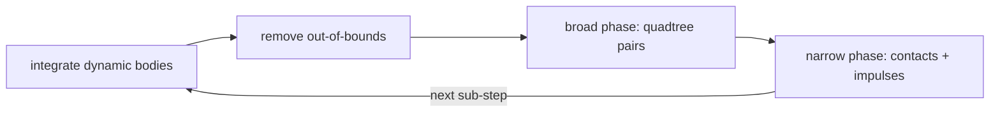

# bocphysics

A 2D rigid-body physics engine written in Python on top of
[`bocpy`](https://pypi.org/project/bocpy/), a library for **Behavior-Oriented
Concurrency (BOC)**. The project doubles as a teaching aid for the Cambridge
4M26 Tripos: the source is written to be read, so readability sits alongside
correctness as a first-class concern.

> **Status: work in progress.** The engine runs and renders, and we are
> actively reshaping the internals. The current focus is preparing the
> physics step for safe parallel execution under BOC. Expect APIs, scenes,
> and numbers in this README to move as the work lands.

## What it does

- Convex-polygon and circle rigid bodies with mass, inertia, and friction.
- A posteriori collision handling: integrate, detect, then resolve with
  impulses over sub-stepped iterations to limit tunnelling.
- Broad-phase detection via a quadtree spatial index (or a brute-force scan).
- Declarative, picklable scene specifications (`bocphysics.scene`).
- An interactive pyglet front-end and a headless benchmark.

## Quick start

```bash
source .env314/bin/activate
pip install -e .[test]       # editable install with test deps
simulation                   # run the interactive simulation
```

Useful flags: `--scene open_box`, `--mode friction`, `--detect quadtree`,
`--debug`, `--show-contacts`. Left-click spawns a circle, right-click spawns a
polygon, space pauses.

## The per-frame step

Each frame subdivides the time step into iterations and, for every
sub-step, integrates the dynamic bodies, prunes those that leave the world,
finds candidate pairs in the broad phase, and resolves real contacts in the
narrow phase.



## Benchmark

[`bench/drop_box.py`](bench/drop_box.py) is a headless perf and convergence
probe. It **streams** a mix of circles and polygons into an open box over the
course of the run, steps the engine without a window, and reports wall-clock
cost per frame plus two convergence proxies: total **kinetic energy** (should
decay toward rest) and total **penetration depth** (should stay bounded). It is
not a reproducible test — `Matrix.uniform` is unseedable, so numbers vary run
to run.

Streaming the drops (rather than releasing one clump) takes the scene through
distinct stages — scattered singletons, then several separate piles, then one
merged pile — which is what exercises the collision **islands** the engine
resolves independently.

```bash
python bench/drop_box.py --shapes 80 --frames 300
python bench/drop_box.py --shapes 80 --frames 300 --snapshot 40,150,300
python bench/drop_box.py --shapes 80 --frames 300 --video drop_box.mp4
```

### Baseline (80 shapes, 300 frames, friction, quadtree)

Averaged over five runs, reported as mean ± one standard deviation; unseedable
spawns mean these are a trend, not a contract.

| Frame | ms/frame | Kinetic energy | Penetration |
|------:|---------:|---------------:|------------:|
|    30 |   0.46 ± 0.11 |     332.50 ± 34.93 |  2.0000 ± 0.0000 |
|    60 |   2.49 ± 0.69 |    2385.39 ± 191.58 |  2.0000 ± 0.0000 |
|    90 |   3.83 ± 0.92 |    7742.34 ± 521.21 |  2.0000 ± 0.0000 |
|   120 |   5.16 ± 0.71 |  15202.71 ± 1443.77 |  2.0000 ± 0.0000 |
|   150 |   8.49 ± 0.82 |  13061.50 ± 1169.25 |  2.0001 ± 0.0002 |
|   180 |  17.27 ± 3.29 |  10165.24 ± 1823.62 |  2.0020 ± 0.0035 |
|   210 |  33.52 ± 5.60 |   8243.60 ± 1228.24 |  2.0236 ± 0.0170 |
|   240 |  52.06 ± 5.49 |    6114.72 ± 672.74 |  2.0229 ± 0.0042 |
|   270 |  73.29 ± 5.08 |    2206.44 ± 750.58 |  2.0557 ± 0.0372 |
|   300 |  87.66 ± 9.08 |     220.15 ± 66.29 |  2.0463 ± 0.0148 |

Mean 28.4 ± 2.8 ms/frame over the five runs. Cost climbs steadily as bodies
accumulate and islands merge; kinetic energy peaks mid-run while shapes are
still falling, then collapses as the pile settles. Penetration stays bounded
near 2 throughout — the behaviour we want from the contact solver.

### Snapshots

The benchmark can render selected frames through a pyglet window with
`--snapshot`, or encode the whole run to an mp4 with `--video` (needs ffmpeg).
Below, three stages of the streamed drop: a few early bodies, several distinct
piles, and the final merged pile.

| Frame 40 (singletons) | Frame 150 (distinct islands) | Frame 300 (settled) |
|:---:|:---:|:---:|
|  |  |  |

## Roadmap

- [ ] Resolve contacts per collision **island** with early-exit.
- [ ] Add a Baumgarte position-bias term with penetration slop.
- [ ] Parallelise the step under BOC, validated against this benchmark.
- [ ] Design notes, a walkthrough, and a tutorial.

## License

See [LICENSE](LICENSE).
