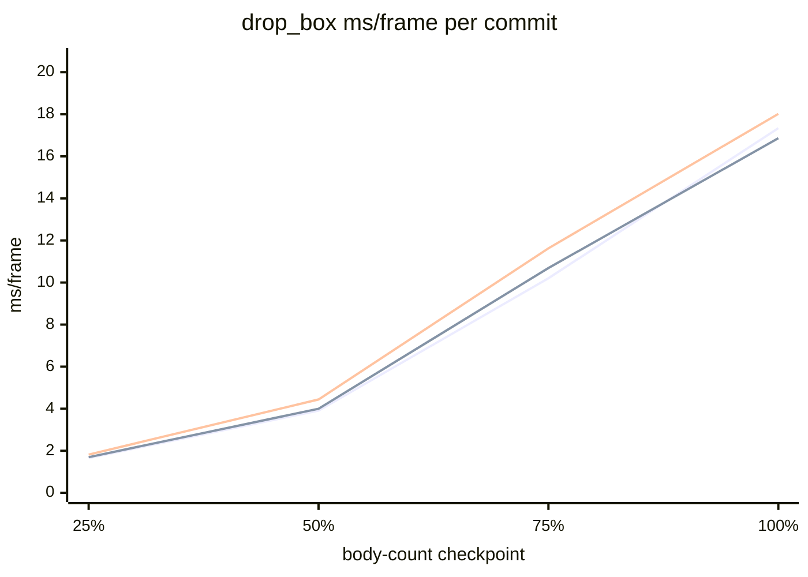

# Refactor Performance Tracker

Each commit is one curve: ms/frame sampled at 25/50/75/100% of the drop_box
run. Because bodies accumulate over frames, later checkpoints carry heavier
scenes, so a curve reads left-to-right as cost against a rising body count.
Curves follow the Measurements table order below. Regenerate with:

```bash
python scripts/track_refactor.py --shapes 80 --frames 300 --seed 7 --detect quadtree
```



## Measurements

| Commit | Subject | Date | 25% | 50% | 75% | 100% |
| --- | --- | --- | --- | --- | --- | --- |
| 4533f7b | Baseline: XPBD/Jacobi | 2026-07-06 | 1.657 | 3.907 | 10.203 | 17.339 |
| b810c32 | Cleaning up + type refactor | 2026-07-07 | 1.695 | 3.997 | 10.690 | 16.863 |
| 8e0c3dc-dirty | cown exploration WIP | 2026-07-08 | 1.819 | 4.440 | 11.625 | 18.019 |
