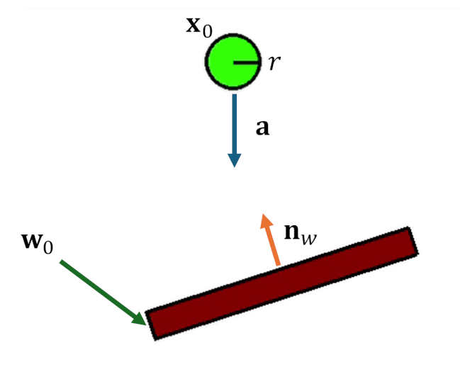

# Chapter 1: Rigid-body physics

Before any code runs in parallel, there has to be something worth parallelising.
This chapter builds that something: the smallest honest model of a rigid body
moving under gravity. By the end you will understand every field the engine
stores on a body and exactly how one body is advanced through a single instant
of time.

All of the code in this chapter lives in
[`src/bocphysics/bodies.py`](../../src/bocphysics/bodies.py).

## What "rigid body" means

A **rigid body** is an object that moves and rotates but never deforms. The
distance between any two points on it is fixed for all time. That single
assumption is what makes the simulation tractable: instead of tracking the
position of every particle in the object, we only need to track

- where the body is — its **position**, a point in the world, and
- how it is turned — its **angle**, a single number in 2D.

Everything else about the body's shape is fixed relative to those two values.
A square that is at position $(3, 4)$ rotated by $30°$ has its four corners
completely determined; we never store the corners' world positions, we *derive*
them when we need them.

## The state of a body

A body in motion needs more than where it is now; it needs to know how it is
moving so we can predict where it will be next. The engine stores six numbers
(some of them 2D vectors) on every dynamic body:

| Field | Symbol | Meaning |
|-------|--------|---------|
| `position` | $\mathbf{x}$ | where the body's centre of mass is |
| `angle` | $\theta$ | how far the body is rotated |
| `linear_velocity` | $\mathbf{v}$ | how fast the centre of mass is moving |
| `angular_velocity` | $\omega$ | how fast the body is spinning |
| `mass` | $m$ | resistance to being pushed |
| `inertia` | $I$ | resistance to being spun |

The first four change every frame; they are the body's *dynamic state*. The last
two are constants determined by the body's shape and density when it is created.

### Why mass and inertia are stored inverted

Look closely at the constructor and you will find that bodies actually store
`inv_mass` ($1/m$) and `inv_inertia` ($1/I$) rather than $m$ and $I$:

```python
inv_mass = 1 / mass
inv_inertia = 1 / inertia
```

There are two reasons for this. First, the equations that resolve a collision
divide by mass far more often than they multiply by it, so storing the inverse
turns repeated divisions into cheaper multiplications. Second, and more
elegantly, it gives us a clean way to express an **immovable** body: a static
floor or wall is modelled as a body with *infinite* mass, and $1/\infty = 0$.
Setting `inv_mass = 0` and `inv_inertia = 0` makes a body that no impulse can
ever accelerate — it simply absorbs every push. This is why the engine has no
separate "static body" class; a static is just a body whose inverse mass is
zero.

## Moving a body through time

Physics tells us how a body's state changes from one instant to the next.
Gravity applies a constant downward acceleration $\mathbf{g}$; acceleration is
the rate of change of velocity; velocity is the rate of change of position. In
the language of calculus:

$$
\frac{d\mathbf{v}}{dt} = \mathbf{g}, \qquad \frac{d\mathbf{x}}{dt} = \mathbf{v}.
$$



*A body at position $\mathbf{x}_0$ falling under a constant downward
acceleration. Velocity and position evolve by the equations above; the inclined
surface and its normal $\mathbf{n}_w$ are a preview of the collision handling in
[Chapter 2](02-serial-engine.md).*

A computer cannot follow those equations continuously. Instead it takes a small
**time step** `dt` — a fraction of a second, typically $1/60$ for a 60 fps
simulation — and advances the state by that much, over and over. Turning a
continuous equation into a repeated discrete update is called **numerical
integration**.

The engine's integrator is four lines long:

```python
def step(self, dt: float, gravity: Matrix):
    """Integrate the circle's velocity and position over the time step."""
    self.linear_velocity += gravity * dt
    self.position += self.linear_velocity * dt
    self.angle += self.angular_velocity * dt
    self.update_needed_ = True
```

### Why the order of these lines matters

It is tempting to read those lines as interchangeable, but the *order* encodes a
real choice. Notice that velocity is updated **first**, and then position is
advanced using that **new** velocity. This scheme is called **semi-implicit
(symplectic) Euler**, and it is the standard choice for games and interactive
physics.

The naive alternative — *explicit* Euler — would move the position using the
*old* velocity before updating it. That version quietly injects energy into the
system every step: a frictionless pendulum would swing higher and higher until
it flew apart. Semi-implicit Euler does not have this defect; its energy error
stays bounded, so stacks settle and orbits stay stable. Swapping the first two
lines would visibly destabilise the simulation, which is exactly the kind of
subtlety that makes integration order worth calling out.

## Shape, geometry, and lazy recomputation

The integrator moves a body's centre and angle, but to *draw* the body or to
test it for collisions we need its actual outline in world space. A polygon
stores its corners once, in **local coordinates** relative to its own centre.
The world positions of those corners are produced by rotating and translating
the local ones. Because the corners (and the edge normals) are kept together as
one `(N x 2)` block, that whole transform is a single matrix multiplication
rather than a Python loop over individual vertices.

Recomputing that transform every time anything asks for a corner would be
wasteful, because a body's transform only changes when it actually moves. The
engine therefore uses a **dirty flag**: `step` (and any other mutation) sets
`update_needed_ = True`, and the world-space geometry is rebuilt lazily the next
time it is read, then cached until the body moves again. You will see this same
"do the expensive thing only when the input changed" pattern reappear later when
the parallel stepper decides when to re-publish geometry to its workers.

## The axis-aligned bounding box

One derived quantity matters enough to call out now: each body's
**axis-aligned bounding box** (AABB), the smallest upright rectangle that
contains it. The AABB is cheap to compute and cheap to test, so the engine uses
it as a fast first approximation of where a body is. Two bodies whose boxes do
not overlap cannot possibly be touching, and that single observation is the
foundation of the collision pipeline in the next chapter.

```python
def disjoint(self, other: "AABB") -> bool:
    return (self.left > other.right or
            self.right < other.left or
            self.top > other.bottom or
            self.bottom < other.top)
```

## Where we are

We now have a body that knows its position, orientation, and how it is moving;
an integrator that advances it through time without leaking energy; and a
bounding box that summarises where it is. A world full of these bodies would
fall under gravity forever, though — they would pass straight through one
another, because nothing yet detects or resolves contact.

That is the subject of [Chapter 2](02-serial-engine.md): the full single-frame
pipeline that finds collisions and resolves them into believable, stable
stacking behaviour.
