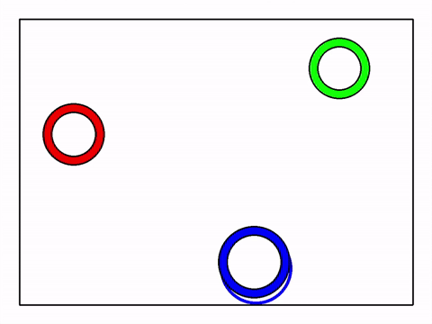
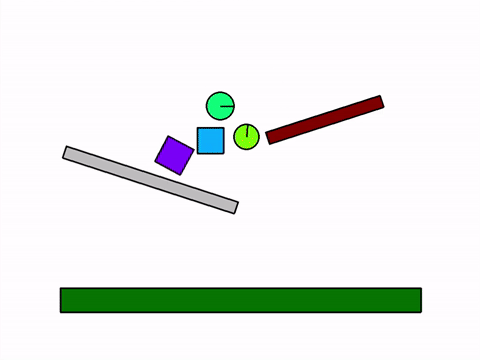
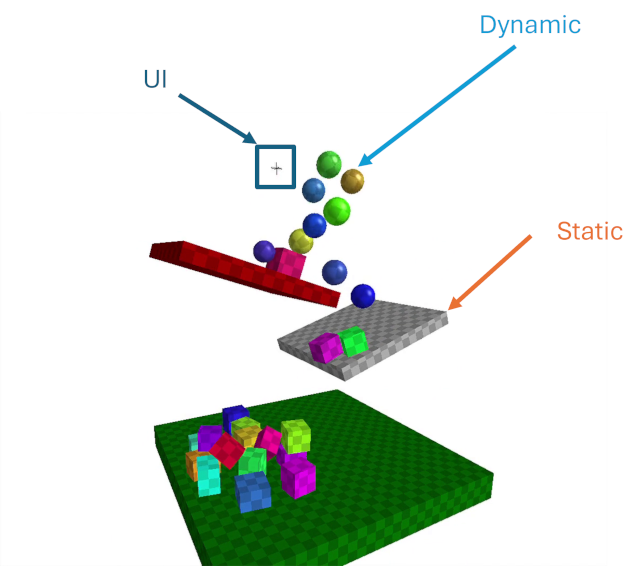
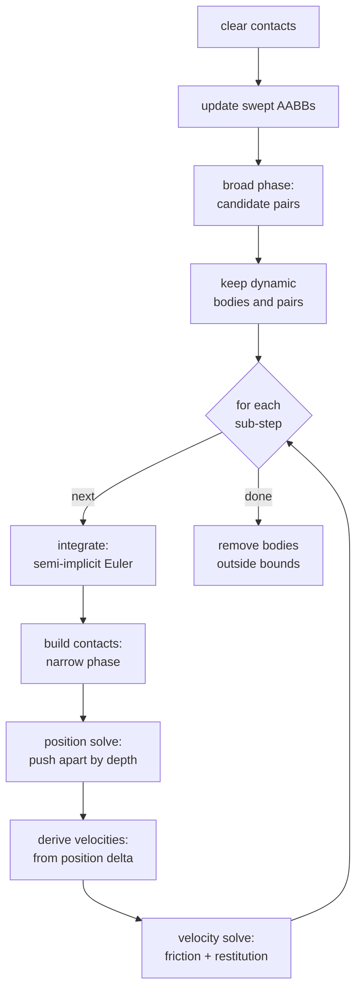
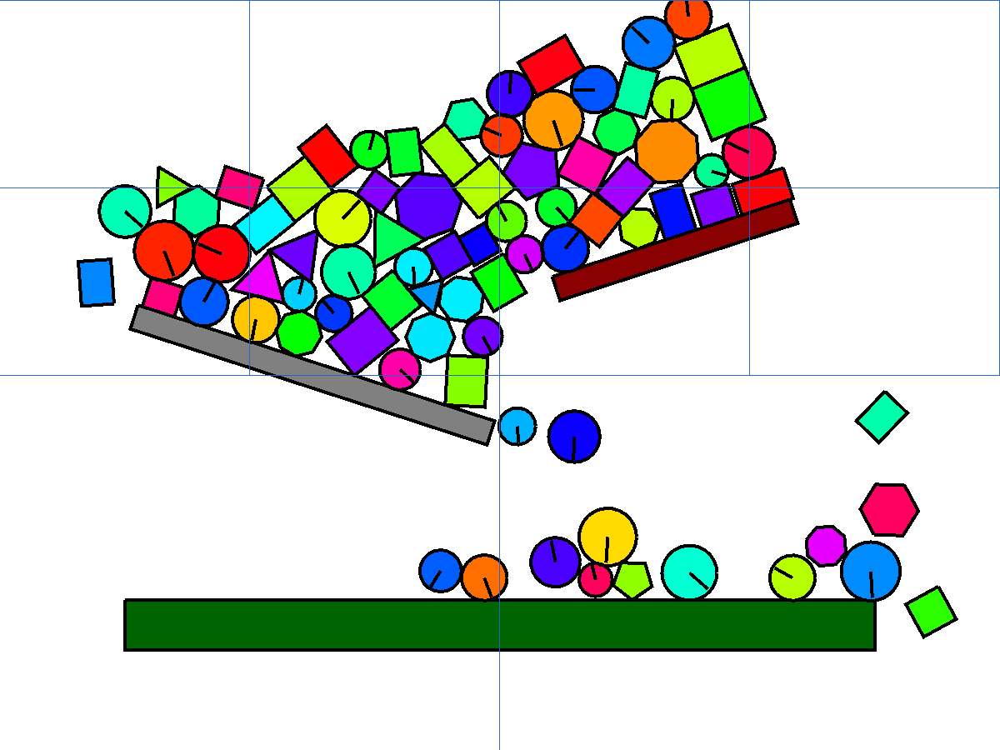
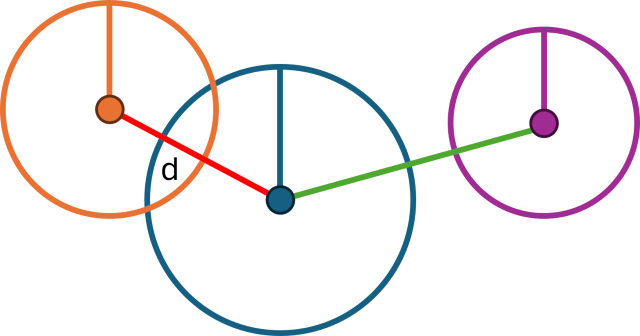
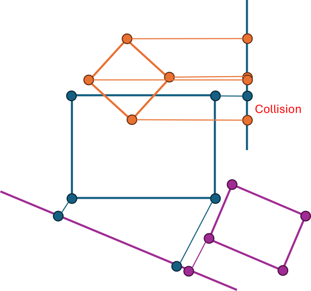
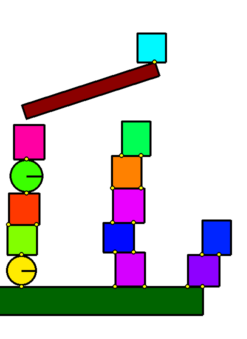

# Chapter 2: The serial engine

[Chapter 1](01-rigid-body-physics.md) gave us a single body that falls under
gravity. A world with one body is not very interesting: it just accelerates
downward forever. The moment we add a second body, or a floor, we need to answer
two new questions every frame — *which bodies are touching?* and *what should
happen to them now that they are?*

This chapter walks the **entire single-threaded frame**, from the raw body list
to a settled, believable pile. Everything here runs on one thread; the parallel
machinery comes much later. Getting the serial engine right first is not a
detour — it is the reference the parallel version must reproduce.

The frame driver lives in
[`src/bocphysics/engine.py`](../../src/bocphysics/engine.py); the collision and
solver stages live in the neighbouring `detection.py`, `collisions.py`,
`contacts.py`, `xpbd.py`, and `physics.py`.

## Step first, fix afterwards

There are two broad ways to stop bodies from passing through each other.

The first is to predict the future. Given each body's position and velocity, you
can solve for the exact instant it *will* hit something, advance time to that
instant, resolve the hit, and repeat. This is **a priori** (before-the-fact)
collision detection, and it is beautifully exact:



The trouble is that the maths explodes as the world gets richer. Add gravity and
finding the moment of impact already means solving a quadratic; add a spinning,
inclined ledge and it becomes a quartic; add a hundred bodies that can all hit
each other and the approach collapses under its own algebra.

bocphysics takes the second route, **a posteriori** (after-the-fact): take a
small step *blindly*, then look for any overlaps you just created and push them
apart.



The price of stepping blindly is **tunnelling**: if a body moves far enough in
one step, it can jump clean through a thin wall before anyone notices the
overlap. The defence is to chop each frame into several smaller **sub-steps**,
so no single advance is large enough to skip past an obstacle. We will see
exactly where that subdivision happens further down.

## A body is the components it has

Before tracing the frame, look at how a body joins the world. The engine does
not have separate `DynamicBody`, `StaticBody`, and `Sprite` classes. Instead a
body simply *is* the set of attributes it carries, and three **systems** decide
what it participates in:

```python
self.systems = {
    "physics": ["position", "angle",
                "linear_velocity", "angular_velocity",
                "mass", "inertia"],
    "collision": ["aabb"],
    "render": ["position", "color"]
}
```

When a body is added, `add_body` stamps a boolean for each system depending on
whether the body has all of that system's components:

```python
def add_body(self, body: RigidBody):
    for system, components in self.systems.items():
        has_system = all(hasattr(body, component) for component in components)
        setattr(body, system, has_system)
    body.uid = self.next_uid
    self.next_uid += 1
    self.bodies.append(body)
```

This is a small **entity–component–system** design, and it buys real
simplicity. A static floor is just a body that has a `position` and an `aabb`
but no `mass`, so `body.physics` is `False`: it collides and renders, but is
never integrated or pushed. There is no "is this a wall?" special-casing
anywhere in the solver — the `physics`, `collision`, and `render` flags carry
all of it.



You can see the flags doing their job in `step`, which solves only the bodies
that have physics and only the pairs that involve at least one of them:

```python
bodies = [body for body in self.bodies if body.physics]
pairs = [(a, b) for a, b in self.collisions if a.physics or b.physics]
```

## The frame at a glance

Here is the whole driver. It is short because each stage delegates to a
dedicated module:

```python
def step(self, dt: float):
    self.contacts.clear()
    self.update_swept_aabbs(dt)

    self.collisions.clear()
    self.broad_phase()
    bodies = [body for body in self.bodies if body.physics]
    pairs = [(a, b) for a, b in self.collisions if a.physics or b.physics]

    sub_dt = dt / self.num_substeps
    self.solve_substep(bodies, pairs, sub_dt)

    self.remove_outside()
```

Laid out as a pipeline, one frame looks like this:



The **broad phase** runs once per frame and is deliberately cheap and
approximate; the **narrow phase** and the **solver** run inside the sub-step
loop, where accuracy matters. The next three sections take those stages in turn.

## Broad phase: who might be touching

With $n$ bodies there are $n(n-1)/2$ possible pairs, and running the exact
collision test on all of them is wasteful — almost none of them are anywhere
near each other. The **broad phase** is a fast, conservative filter that throws
away pairs that obviously cannot collide, leaving a short list of *candidates*
for the expensive test.

The tool for "obviously cannot collide" is the **axis-aligned bounding box**
from [Chapter 1](01-rigid-body-physics.md#the-axis-aligned-bounding-box). Two
bodies whose boxes do not overlap cannot be touching, and box overlap is four
comparisons:

```python
def disjoint(self, other: "AABB") -> bool:
    return (self.left > other.right or
            self.right < other.left or
            self.top > other.bottom or
            self.bottom < other.top)
```

Because a body moves during the frame, the engine first inflates each body's box
into a **swept AABB** that covers where it is *and* where it is heading, so a
single broad-phase pass stays valid for every sub-step. `update_swept_aabbs`
grows a dynamic body's box along `linear_velocity * dt` (statics grow only by a
small slop) and clamps the result to the world.

The simplest way to use these boxes is the brute-force scan in
`find_all_intersections_basic` — every pair, once, skipping non-colliding
bodies. It is $O(n^2)$ and perfectly correct, and it is the right thing to write
first. To quote Knuth, *premature optimization is the root of all evil*; make it
work, then make it fast.

For busier scenes the engine's default detection mode is instead a
**quadtree** (the brute-force scan stays available for comparison via
`--detect basic`). Each node owns a square region and, once it holds more than a
threshold of bodies, splits into four child quadrants. A body that fits cleanly
inside one quadrant descends into it; a body straddling several stays at the
parent. Collisions are then found by testing only bodies that share or overlap a
node, pruning whole subtrees whose box is disjoint from the body in hand:



In the overlay above (drawn live by `--overlay quadtree`) the cells stay coarse
over empty space and subdivide where the pile is dense — exactly where the extra
resolution pays off. The structures and the two recursive walks live in
[`quadtree.py`](../../src/bocphysics/quadtree.py); the mode is selected in
[`detection.py`](../../src/bocphysics/detection.py).

Whatever the mode, the broad phase produces the same thing: a list of candidate
pairs whose boxes overlap. Some of those pairs will turn out not to be touching
at all. Deciding that is the narrow phase's job.

## Narrow phase: who is *actually* touching

The narrow phase runs the exact test on each candidate pair and, when they do
overlap, reports *how*. `detect_collision` dispatches on the shapes involved:

```python
def detect_collision(a: RigidBody, b: RigidBody) -> Collision:
    if isinstance(a, Circle):
        if isinstance(b, Circle):
            return intersect_circle_circle(a, b)
        return intersect_circle_polygon(a, b)
    elif isinstance(a, Polygon):
        if isinstance(b, Circle):
            collision = intersect_circle_polygon(b, a)
            return collision.reverse() if collision else None
        return intersect_polygon_polygon(a, b)
```

Two circles are the easy case: they touch when the distance between their
centres is less than the sum of their radii. The code compares *squared*
distances so it only pays for a square root when there really is a collision:



Polygons use the **Separating Axis Theorem** (SAT), which rests on one fact:

> If two convex shapes do not overlap, there is some axis on which their
> projections (their shadows) do not overlap either.

So the test projects both shapes onto every candidate axis — the face normals of
both polygons — and looks for a gap. The instant one axis shows a gap, the
shapes are disjoint and the function returns; since most candidate pairs are not
actually colliding, this early-out is what makes SAT cheap in practice.



If *no* axis separates them, the shapes overlap, and the axis with the
*smallest* overlap is the most efficient direction to push them apart. That axis
is the **collision normal** and the overlap is the **penetration depth** —
together the *minimum translation vector* (MTV) that the solver will use. In
bocphysics every projection is a single batched matrix multiply rather than a
Python loop over vertices:

```python
# one batched matmul projects every vertex of both polygons onto every axis
a_proj = a.transformed_vertices @ nt
b_proj = b.transformed_vertices @ nt
...
axis = normals[depth.argmin()]   # minimum-overlap axis is the contact normal
```

A circle against a polygon is the same idea with one extra axis — the direction
from the circle's centre to the nearest polygon vertex — which catches the case
where a circle rests against a corner. Note that this is SAT, **not** GJK: there
is no Minkowski-difference simplex here, just projections onto a fixed set of
axes.

## Contact points

The normal and depth tell the solver *which way* to push, but the solver also
needs to know *where* to push — the **contact points**. For a circle there is
exactly one, its centre plus the normal times its radius. For two polygons there
can be one (a corner resting on a face) or two (an edge lying flat on a face):



`find_contact_points` finds them by sweeping every edge of one polygon against
every vertex of the other and keeping the closest. The subtlety is that
floating-point distances are never exactly equal, so "the two points that share
the minimum distance" cannot be a straight comparison. The scan keeps a running
minimum and an epsilon band around it: a distance below the band *replaces* the
manifold, a distance inside the band *adds* a second point, and a distance above
it is ignored. Each kept point also carries a `(body_uid, vertex_index)` feature
ID so the contact can be recognised again next frame.

The whole query is pure geometry with no side effects, which matters later: the
parallel workers run the identical contact code and must get byte-identical
points.

## Resolving contacts: sub-steps and position-based dynamics

Now the engine knows every overlap, its normal and depth, and its contact
points. Turning that into motion is `solve_substep`, which hands the work to the
shared solver core so the serial and parallel paths run the *same* solve:

```python
def solve_substep(physics, bodies, pairs, gravity, h, contacts=None):
    previous = snapshot_poses(bodies)              # remember where each body started
    integrate_block(bodies, gravity, h)            # step blindly forward by h
    constraints = build_contacts(pairs, contacts)  # narrow phase at the new pose
    lambdas = solve_positions(constraints)         # push overlaps apart in position
    derive_velocities(bodies, previous, h)         # velocity = (new - old) / h
    solve_velocities(physics, constraints, lambdas, h, gravity)  # friction + bounce
```

This is **Extended Position-Based Dynamics** (XPBD), the rigid-body scheme of
[Müller 2020](07-references.md#muller-2020), and it is worth pausing on because it
runs backwards from what you might expect. A classical solver computes contact
*forces*, turns them into impulses, and integrates those into velocities. XPBD
moves the bodies first, corrects their **positions** until they no longer overlap,
and only then reads the velocity *back* from how far each body actually moved.
Position is the primary variable; velocity is a consequence.

A whole frame is just this sub-step repeated:

```python
def solve_group_substep(physics, bodies, pairs, gravity, sub_dt, num_substeps, contacts=None):
    for _ in range(num_substeps):
        solve_substep(physics, bodies, pairs, gravity, sub_dt, contacts)
```

The single knob is `num_substeps` (default 8). Each sub-step integrates the bodies
forward by `dt / num_substeps`, rebuilds the contacts at the new pose, and solves
them once. There is **no inner iteration count** — XPBD does a single position pass
and a single velocity pass per sub-step, and convergence comes from *taking more,
smaller sub-steps* rather than from sweeping the same contacts over and over. More
sub-steps means smaller advances, less tunnelling, and a stiffer pile; for a given
amount of work many small sub-steps beat a few large ones
([Macklin 2019](07-references.md#macklin-2019)).

### The position solve

`build_contacts` re-runs the narrow phase at the freshly integrated pose and emits
one **constraint** per penetrating contact point (dropping any false positive the
broad phase let through). `solve_positions` then makes a single Gauss–Seidel pass
over them, pushing each overlapping pair apart along its normal:

```python
w = generalized_inverse_mass(a, r_a, normal) + generalized_inverse_mass(b, r_b, normal)
magnitude = depth / w
apply_positional_impulse(a, b, r_a, r_b, normal * magnitude)
```

The pair is moved apart by the penetration `depth`, split between them in
proportion to their **generalised inverse mass** `w` — the same inverse masses
from [Chapter 1](01-rigid-body-physics.md#why-mass-and-inertia-are-stored-inverted),
now carrying a rotational term $(\mathbf{r}\times\mathbf{n})^2 / I$ so an
off-centre hit also imparts spin. A static wall contributes nothing to `w`, so it
takes none of the correction and the moving body is pushed out on its own.
"Gauss–Seidel" means the pass visits contacts one at a time and each sees the
positions the earlier ones just nudged, so a correction propagates up a stack —
the floor pushes the bottom box, which pushes the next. The push-out magnitude is
recorded as a **lambda**, the accumulated normal correction the velocity pass will
reuse. For rigid contacts the XPBD *compliance* is zero; a soft constraint would
divide the push by a non-zero stiffness instead.

### Deriving velocity, then correcting it

Once the positions are settled, `derive_velocities` reads each body's velocity
straight off its motion over the sub-step:

$$
\mathbf{v} = \frac{\mathbf{x}_{\text{new}} - \mathbf{x}_{\text{old}}}{h},
\qquad
\omega = \frac{\theta_{\text{new}} - \theta_{\text{old}}}{h}.
$$

This is the heart of position-based dynamics: a body pushed out of a wall now *has*
the outward velocity that push implies, for free, with no impulse formula.
`solve_velocities` then makes one final pass to add the two effects that positions
alone cannot capture — **restitution** and **friction**:

```python
e = 0.0 if abs(vn) <= 2 * g * h else physics.restitution
dvn = -vn + max(-e * bias_velocity, 0.0)        # cancel approach, add bounce
```

Restitution adds back a fraction `e` of the closing speed sampled *before* the
solve, so a ball rebounds. The bounce is **gated off** (`e = 0`) when the approach
speed is down at the gravity scale `2·g·h` — that is what stops a resting stack
from buzzing as gravity re-presses it each sub-step, the position-based answer to
the old *restitution target*. Friction caps the tangential velocity change at the
Coulomb bound `μ_d · f_n`, where the normal force `f_n = λ / h²` is recovered from
the position lambda — stick when it can, slide when it must.

Every one of these functions is a module-level free function over plain bodies,
pairs, and a `Physics` system; nothing is hidden in object state. That is exactly
what lets a worker sub-interpreter run the **identical** solve later —
*same core, different scheduler*. The details live in
[`xpbd.py`](../../src/bocphysics/xpbd.py).

## Where we are

We now have the whole serial frame: a cheap broad phase that nominates candidate
pairs, an exact SAT narrow phase that returns a normal and depth, a contact
generator that says where to push, and a sub-stepped XPBD solver that corrects
positions and reads velocities back to turn all of it into stable, believable
motion. Run it and the `pachinko` and drop-box scenes settle into convincing
piles — on one thread.

That last phrase is the catch. The position and velocity passes walk every
contact one at a time in a Python loop, and on a busy frame — eight sub-steps,
each rebuilding and solving a few hundred contacts — that loop is the bottleneck:
thousands of tiny per-contact calculations, each a handful of Python operations.
[Chapter 3](03-batching.md) looks at why that loop is slow on modern hardware,
and how reshaping the data lets us replace it with dense batched kernels — the
groundwork the parallel solver will build on.
