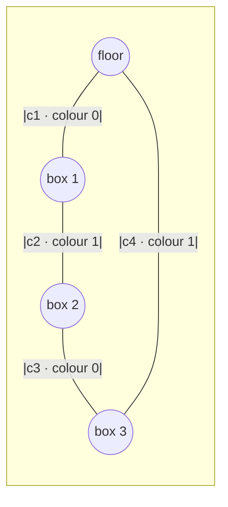

# Chapter 3: Batching for hardware

[Chapter 2](02-serial-engine.md) ended on a confession. The serial engine is
correct and readable, but its hot loop — the projected Gauss–Seidel sweep that
resolves every contact, several times, every sub-step — is a Python `for` loop
doing a handful of tiny floating-point operations per contact. On a busy frame
that is *tens of thousands* of trips around the interpreter, and the interpreter
overhead dwarfs the actual arithmetic.

This chapter is about closing that gap **without changing scheduler or adding a
single thread**. We reshape the data so the same solve runs as a few dense
matrix operations instead of thousands of scalar ones. The payoff is twofold: it
is faster on one core today, and — crucially for the chapters ahead — the
reshaped, body-disjoint form is exactly what lets the solve be handed to
parallel workers later without tearing.

The batched solver lives in
[`src/bocphysics/kernel.py`](../../src/bocphysics/kernel.py); it is wired into
the serial path through `resolve_pair_list` in
[`solver.py`](../../src/bocphysics/solver.py).

## Why the scalar loop is slow

Look again at the shape of the serial velocity solve from Chapter 2:

```python
for _ in range(num_velocity_iterations):
    for constraint in constraints:
        physics.apply_accumulated(constraint, ...)
```

Every `apply_accumulated` call does the same thing: read two bodies' velocity
and spin, compute a relative velocity, divide by an effective mass, clamp, and
write the result back. The *arithmetic* is trivial — a dozen multiplies and
adds. The *cost* is everything around it: a Python function call, attribute
lookups on the constraint, boxing each intermediate into a Python float, and the
bytecode dispatch for every single operation. For one contact this is invisible.
For a settled pyramid of a few hundred bodies, with ten velocity iterations
inside four sub-steps, it is the whole frame budget.

The fix is the same one the integrator already used in Chapter 1. There,
`integrate_block` advanced *every* dynamic body in three operations by stacking
their state into blocks:

```python
velocity = velocity + gravity * dt
position = position + velocity * dt
angle = angle + spin * dt
```

That is a **structure-of-arrays** (SoA) layout: instead of a list of body
objects each holding their own fields (an array of structures), the engine holds
one block per *field* — all the velocities together, all the positions together.
The per-element float cost is paid once, in C, across the whole block. The
integrator is bit-identical to the per-body loop; it is just paid in bulk.

We want to do the same to the velocity solver. The obstacle is that, unlike
integration, **contacts are not independent**.

## The write-hazard that blocks naïve batching

Integration touches each body exactly once, so stacking the bodies and updating
them all at once is trivially safe. A velocity iteration is different: a single
body can be in many contacts at once — the box at the bottom of a stack touches
the floor *and* the box above it *and* the box beside it. Each of those contacts
wants to read that body's velocity and add an impulse to it.

If we tried to solve every contact in one batched shot, two contacts sharing a
body would both read its *old* velocity and both write back, and one update would
clobber the other. That is a classic **write hazard**, and it is exactly the kind
of data race the rest of this tutorial is about avoiding.

The serial loop sidesteps the hazard for free: it visits contacts one at a time,
so each one reads the velocity the previous one just wrote. That *use-the-latest*
ordering is the "Gauss–Seidel" in projected Gauss–Seidel. To batch the solve we
have to recover that safety without giving up the bulk update — and the tool for
that is graph colouring.

## Graph colouring: batches of disjoint contacts

Picture the contacts as a graph. Each **body** is a node; each **contact** is an
edge joining the two bodies it couples. Two contacts *conflict* only when they
share a body — that is, only when their edges meet at a node.

If we could group the contacts so that, within a group, no two edges share a
node, then every contact in the group touches a completely different set of
bodies. Such a group has **no write hazard at all**: we can read every body's
velocity, compute every impulse, and write every result in one batched pass,
because no two writes land on the same body.

This is precisely **edge colouring**: assign each edge a colour such that edges
sharing a node get different colours. Each colour is then a set of mutually
body-disjoint contacts — a batch we can solve in bulk. Edge-colouring the
constraint graph is the same device production engines use to expose the solver
to wide SIMD and to parallel workers ([Rouwe 2022](07-references.md#rouwe-2022);
[Box2D](07-references.md#box2d-v3)).



Here contacts `c1` and `c3` share no body, so both take colour 0 and solve
together; `c2` and `c4` likewise share none and take colour 1. No colour ever
contains two contacts that touch the same box. The engine does this greedily, in
deterministic input order, in `greedy_edge_color`:

```python
for idx, (end_a, end_b) in enumerate(items):
    taken = used.get(end_a, set()) | used.get(end_b, set())
    color = 0
    while color in taken:
        color += 1
    colors[idx] = color
    used.setdefault(end_a, set()).add(color)
    used.setdefault(end_b, set()).add(color)
```

Each contact takes the smallest colour not already used by either of its
endpoints. The order is the deterministic manifold-build order, so the colouring
is identical no matter how many workers run later — a property the parallel
chapters lean on hard.

One subtlety: a **static** body (the floor) has zero inverse mass, so writing an
impulse onto it changes nothing. `colour_manifolds` gives every static occurrence
a *fresh negative id* so two contacts that both touch the floor are never forced
into different colours on the floor's account — only shared *movable* bodies
create a conflict.

## Inside one colour: gather, solve, scatter

With the contacts coloured, a colour is solved in three moves that mirror the SoA
integrator: **gather** the bodies' state, **compute** the impulses row-wise, and
**scatter** the results back.

First the bodies a colour touches are packed into velocity, spin, and
inverse-mass blocks (`pack_bodies`), and each contact records the *row index* of
its two bodies. Packing the contacts (`pack_contacts`) stacks the normals,
tangents, lever arms, and effective-mass denominators into per-contact $(K
\times n)$ blocks. Then one iteration is pure array arithmetic:

```python
va = vel[idx_a]            # gather both bodies' velocity, one row per contact
vb = vel[idx_b]
rel = (vb + blocks["rb_perp"] * wb) - (va + blocks["ra_perp"] * wa)
vn  = rel.vecdot(n_block, axis=1)
j   = ((blocks["v_target"] - vn) / blocks["denom"] * blocks["weight"]).clip(0.0, INF)
impulse = j * n_block
```

`vel[idx_a]` is a **gather**: it builds a per-contact block by pulling the row
each contact named. The impulse for every contact in the colour is computed in
one shot — no Python loop over contacts — and the `clip(0, inf)` reproduces the
scalar solver's *push-only* rule (a contact may only push bodies apart, never
pull them together) across the whole block at once.

The result is written back with a **scatter-add**:

```python
vel.put(idx_a, dva, accumulate=True)
vel.put(idx_b, dvb, accumulate=True)
```

`put(accumulate=True)` folds repeated row indices additively, so a two-point
manifold that writes both contact points onto the same body sums correctly.
Within the colour the bodies are disjoint, so no two *different* contacts ever
write the same row — the hazard is gone by construction, and the batched update
for one colour is **exactly** the scalar sweep over that colour, body for body.

## Across colours: still Gauss–Seidel

A colour is internally hazard-free, but the colours are not independent of each
other — the floor is in colour 0 *and* colour 1. So the colours are still solved
**in sequence**, one after another, each seeing the velocities the previous
colours just wrote:

```python
for _ in range(num_velocity_iterations):
    for (blocks, idx_a, idx_b), lam in zip(packed, lambdas):
        solve_colour(physics, vel, spin, inv_m, inv_i, blocks, idx_a, idx_b, lam)
```

This is the same projected Gauss–Seidel as the serial path — *use the latest
value* — but the unit of work is now a whole colour instead of a single contact.
Inside a colour the update is a batched Jacobi sweep (all reads, then all
writes); across colours it is Gauss–Seidel. The accumulated-impulse bookkeeping
from Chapter 2 survives intact: each colour carries a running normal and tangent
impulse `lam` across the iterations, clamps the *total*, and applies only the
change, so a later sweep can still release an earlier over-push.

There is one honest cost to record. The serial FRICTION path visits contacts in
a gravity-aligned, apex-first order; the batched path visits them in
colour-disjoint order. Both are valid Gauss–Seidel sweeps over the same
constraints, but a different visiting order is a different re-linearisation, so
the two do **not** agree bit-for-bit at a finite iteration count. They converge to
the same settled solution, which is why the batched kernel is validated by
*settling-band* tests — does the pile come to rest in the right place? — rather
than against the bit-exact golden master that guards the scalar path.

## The A/B switch

The batched kernel is not a rewrite of the solver; it is an alternate
implementation of the *same* velocity iteration, selected by a flag. The serial
driver reads a module-level toggle:

```python
# solver.py
use_batched_solver = False        # A/B toggle, scalar by default
```

and `--batched` flips it at startup:

```python
# __init__.py
from . import solver
solver.use_batched_solver = args.batched
```

`resolve_pair_list` then routes a contact-mode solve either to the scalar loop or
to `resolve_batched`, and nothing else in the engine knows which ran. That clean
seam is deliberate. It means the batched path can be measured head-to-head
against the scalar one (Chapter 5 does exactly that), and it means the *parallel*
workers in the next chapters can opt into the same kernel by passing the flag
explicitly — a worker sub-interpreter cannot see the main interpreter's module
global, so the parallel path carries the value itself.

## Where we are

We have taken the serial solver's scalar hot loop and reshaped it into dense
kernels: pack the bodies into structure-of-arrays blocks, edge-colour the
contacts into body-disjoint batches, then gather–solve–scatter one colour at a
time. The arithmetic is unchanged; only its *evaluation* is batched, and the
colouring is the move that makes a batch safe.

That last point is the bridge to everything that follows. A colour is a set of
contacts that touch **disjoint** bodies — which is also the exact condition under
which two pieces of work can run *at the same time* without racing. We reached
for colouring to vectorise on one core, but we have accidentally drawn the map
for parallelism. [Chapter 4](04-converting-to-boc.md) follows that map into
Behavior-Oriented Concurrency — and tells the honest story of the partitioning
schemes that failed before the one that shipped.
