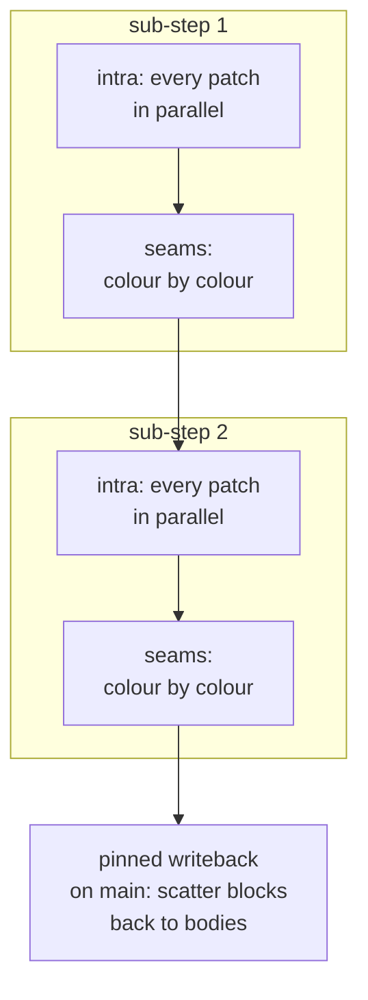

# Chapter 4: Converting to BOC

[Chapter 3](03-batching.md) ended with an accident. We reached for graph
colouring to *vectorise* the solver on one core — group the contacts so that no
two in a group touch the same body — and in doing so we drew a map for something
else entirely. A group of contacts that touch **disjoint** bodies is exactly a
group of contacts that could be solved *at the same time* on different cores
without ever stepping on each other.

This chapter follows that map from one core to many. But it does **not** do so
with threads and locks. bocphysics parallelises with
[Behavior-Oriented Concurrency (BOC)](https://pypi.org/project/bocpy/), a model
that removes data races and deadlocks *by construction* rather than asking us to
get the locking right. The chapter tells the honest version of the story: the
instinct that fails, why BOC reframes the problem, and the partitioning scheme
that shipped after a more obvious one fell short.

The parallel scheduler lives in
[`src/bocphysics/parallel.py`](../../src/bocphysics/parallel.py); the world is
cut into pieces by [`patches.py`](../../src/bocphysics/patches.py).

## The instinct that fails

The obvious way to parallelise the solver is to keep the shared velocity arrays
from Chapter 3 and hand each thread a slice of the contacts. Thread A solves the
left half of the pile, thread B the right half, both reading and writing the same
body velocities.

This is the write hazard from Chapter 3 again, except now it is not a
batching nuisance — it is a genuine **data race**. A body on the boundary between
the two halves is touched by both threads; both read its velocity, both add an
impulse, and one update silently overwrites the other. The result is
nondeterministic garbage.

The classical fix is a lock per body: a thread must acquire a body's lock before
touching it. But a contact touches *two* bodies, so a thread must hold two locks
at once, and the moment two threads try to grab the same two bodies in opposite
order they **deadlock**. Order the locks to avoid that and threads spend their
time waiting on each other instead of solving — the very contention that made the
serial loop slow, now with a synchronisation tax on top.

Locks are the wrong tool because they bolt safety onto data that is still
fundamentally *shared*. BOC takes the opposite stance: stop sharing.

## One rule: own the data, don't guard it

BOC has essentially one idea, and everything else follows from it. Mutable data
is placed inside a **cown** — a *concurrently-owned* wrapper — and code that
wants to touch that data runs as a **behavior** scheduled with `@when`. The
scheduler runs a behavior only once it can take **exclusive** ownership of every
cown the behavior asked for:

```python
@when(state_cown, pairs_cown)
def _intra(state, pairs):
    solve_intra_substep(state, pairs.value)
```

While `_intra` runs, *nothing else* can hold `state_cown`. There is no lock to
acquire and no lock to forget, because access is not guarded — it is *granted*.
Two behaviors that ask for disjoint cowns run in parallel; two that ask for the
same cown are serialised by the scheduler, never by us. The race is impossible to
write.

Three properties of the model do all the work in the engine, and they are worth
stating once:

- **A behavior runs in another interpreter.** On Python 3.12+ each worker is a
  real sub-interpreter, so behaviors run *truly* in parallel. The price is that a
  behavior cannot close over a free variable from the enclosing scope; anything
  it needs beyond its cowns must be a trailing parameter with a default, and
  every function or class it uses must be importable at module level.
- **Per-cown FIFO is the only ordering.** Behaviors scheduled on the same cown
  run in schedule order. There are no barriers, events, or condition variables
  anywhere in the parallel path — that single guarantee is enough to sequence
  everything.
- **A behavior that must run *after* others simply lists their cowns.** Ordering
  is expressed by *what a behavior asks for*, not by signalling.

The whole job of converting the solver, then, is a *data* question: how do we
carve the world's mutable state into cowns so that most of the work asks for
disjoint ones?

## The most natural BOC design — and why it does not scale

There is an obvious, almost *too* obvious, answer, and it is the first stop on
nearly everyone's "I want to use BOC for this" journey. The unit of mutable state
in the engine is a body; the unit of work is a contact between two bodies. So the
purest possible BOC design is **one cown per body, and one behavior per contact**:

```python
# the tempting, maximally-fine-grained design
body_cowns = {body.uid: Cown(body) for body in dynamic_bodies}

for a, b in candidate_pairs:
    @when(body_cowns[a.uid], body_cowns[b.uid])
    def _resolve(ca, cb):
        resolve_one_contact(ca.value, cb.value)
```

This is beautiful. It is the contact graph from Chapter 3 expressed *directly*:
each contact asks for exactly the two bodies it touches, two contacts that share
no body run in parallel automatically, and two that share a body are serialised by
the scheduler — the colouring we did by hand in Chapter 3 now falls out of the
runtime for free. There is no partitioning code, no seams, nothing to tune. As an
expression of the problem it is hard to beat.

It also falls over the moment the scene stops being a toy. A settled pile has
*thousands* of contacts, and we re-resolve all of them across several velocity
iterations and several sub-steps — so this design asks the scheduler to dispatch
*tens of thousands of tiny behaviors per frame*. Each behavior carries a fixed
scheduling cost: acquiring its cowns, finding a free worker, handing it the work.
When the work inside a behavior is a dozen floating-point operations, that fixed
cost utterly dominates, exactly the way per-contact Python-call overhead dominated
the *serial* loop in Chapter 3. We would have parallelised the arithmetic and then
drowned it in scheduling.

The fix is the same one batching taught us: **make each unit of work bigger**.
Instead of one cown per body, group many bodies into one cown and resolve their
contacts together, so the scheduler dispatches a handful of fat behaviors instead
of a swarm of thin ones. That grouping is the patch — and the price of grouping is
that some contacts now fall *between* groups. Those are the seams, and managing
them is the rest of this chapter.

## Cut the world into patches

The answer is **domain decomposition**: split the world into spatial regions —
the engine calls them **patches** — and make each patch's mutable state one cown.
A patch's bodies are packed into a single dense state block (the structure-of-
arrays layout from Chapter 3, now earning its keep twice over) and dropped into a
`Cown`; its interior candidate pairs ride in a second cown as a compact uid
block:

```python
state_cowns.append(Cown(transport.pack_state(patch.bodies)))
intra_pairs.append(Cown(transport.pack_pairs(uid_pairs)))
```

A candidate pair from the broad phase is now one of two things. If both its
bodies live in the same patch it is an **interior** pair, owned by that patch
alone. If its bodies straddle two patches it is a **seam** (a *boundary pair*)
that couples them. Routing every pair into one bucket or the other is the shared
tail of every partition strategy, in `route_pairs`; dynamic–static contacts
attach to the dynamic body's patch, and the static's geometry reaches that worker
through a shared snapshot, so a wall never forces a seam.

That split maps cleanly onto two behaviors:

- `solve_intra_substep` integrates one patch's bodies for a sub-step and resolves
  its interior pairs. It holds **just that patch's** state cown, so every patch's
  interior solve runs in parallel with every other's.
- `solve_boundary_substep` resolves the seam pairs stitching two patches. It
  holds **both** patches' state cowns, so it runs only when neither neighbour is
  mid-solve.

This is the classic *patch + halo* pattern from parallel physics: tiles that own
their interior and exchange only a thin halo of shared boundary work. The bulk of
the solve — the interior of every patch — is embarrassingly parallel; only the
seams need coordination. Production engines reach for the same island-and-task
shape, solving independent clumps in parallel and coordinating only where they
touch ([Jolt](07-references.md#jolt); [Rapier](07-references.md#rapier)).

## Sequencing sub-steps without a barrier

Recall from Chapter 2 that a frame is several sub-steps, and each sub-step must
*finish* before the next begins — you cannot integrate sub-step 2 until
sub-step 1's contacts are resolved. In a threads-and-locks world that is a
barrier: every thread waits at the end of each sub-step.

BOC needs no barrier. The stepper schedules **all** sub-steps up front, and
per-cown FIFO orders them automatically:

```python
for _ in range(engine.num_substeps):
    for state, pairs in zip(state_cowns, intra_pairs):
        schedule_intra(state, pairs)
    for (i, j), pairs in seams:
        schedule_boundary(state_cowns[i], state_cowns[j], pairs)
```

Because sub-step *k*'s intra behavior is scheduled on a patch's state cown before
sub-step *k*'s seams, and both before sub-step *k+1*, the FIFO discipline replays
them in exactly that order — on whichever worker happens to be free. The
dependency *is* the schedule order on the shared cown; no thread ever explicitly
waits.



## The seam problem, and an old friend

Seams reintroduce a contention problem, and it is worth seeing clearly. Each seam
behavior locks *two* patch cowns. If we schedule seams in an arbitrary order,
seams that share a patch serialise into a chain — patch B's seam with A cannot
run while B's seam with C is running. That is the dining-philosophers effect: the
seam layer collapses to nearly one seam at a time.

The fix is the colouring trick from Chapter 3, now applied to *scheduling* rather
than to vectorising ([Rouwe 2022](07-references.md#rouwe-2022)).
`colored_seam_order` greedily **edge-colours the seam graph** —
bodies become patches, seams become edges — so that no two seams
sharing a patch get the same colour, then emits the seams colour by colour:

```python
for (i, j) in sorted(keys):
    c = 0
    while c in used[i] or c in used[j]:
        c += 1
    colors[(i, j)] = c
```

A whole colour is an independent set of seams: none of them share a patch, so
they can occupy every patch-cown head at once. The number of colours is the
seam layer's depth — its critical path — and shrinking it is the whole game. And
because the colouring is a pure function of the sorted patch-pair keys, the
schedule is identical no matter how many workers run, which keeps the parallel
result deterministic.

## Which cut? The honest part

Everything above works for *any* way of assigning bodies to patches. The
interesting engineering question — and the one with a non-obvious answer — is
*how to draw the patch boundaries*. The seam-colour count is set entirely by
that choice, and it is what bounds the parallel barrier depth.

The first decomposition the engine reaches for is the natural one: a **loose
quadtree**, the same spatial structure the broad phase already uses. Drop every
dynamic body into the quadtree cell its centre falls in, and each populated cell
becomes a patch. It is principled, it adapts to where the bodies actually are,
and the code is still in the tree today as `build_partition` — selected by
passing `num_slabs=None` — precisely so the two cuts can be measured against each
other.

The trouble is gravity. Bodies settle into **vertical stacks**, and a quadtree
cuts the world into squares, so its seams slice *across* those stacks — every
load-bearing contact in a tall pile becomes a seam. That produces a deep,
densely-connected seam graph (around nine colours in the benchmark scene), and a
deep seam graph means a deep per-sub-step critical path. The decomposition is
correct, but the parallelism it exposes is shallow.

The shipped default inverts the geometry. Instead of square cells it cuts the
world into **equal-population vertical slabs** (`build_slab_partition`): sort the
dynamic bodies along the x-axis and split them into `DEFAULT_SLABS` bins of equal
size.

```python
dynamic.sort(key=coord)
count = max(1, min(num_slabs, population_cap)) if total else 0
for rank, body in enumerate(dynamic):
    index = min(count - 1, rank * count // total)
    patch_of[body.uid] = index
```

Two design choices are doing the work here. **Vertical** cuts run *with* gravity's
stacking direction, so they sever very few load-bearing contacts — the seam-colour
count drops from around nine to two-to-four, and the frame runs noticeably faster
than the quadtree cut. **Equal-population** means each slab owns the same number of
bodies regardless of the pile's shape, so the workers are balanced no matter how
lopsided the scene. A floor on each slab's population (`MIN_SLAB_BODIES`) collapses
a small or sparse scene into fewer, fuller slabs rather than degenerate one-body
slabs that would turn every interior contact into a seam.

The lesson is the one this whole tutorial keeps circling: the parallel structure
follows the *physics*. Gravity stacks bodies vertically, so the cut that respects
gravity is the cut that parallelises well. The clever scheduler cannot rescue a
decomposition that fights the problem's geometry.

## What actually crosses each frame

One detail keeps the whole scheme cheap. Most of a body is *immutable* during a
frame — its shape, its mass, its vertices. Only the velocity-and-position state
changes. So the fat, unchanging geometry and the solve configuration are not
packed into cowns at all; they ride the **noticeboard**, a key/value store the
runtime caches per interpreter:

```python
notice_seed(CONFIG_KEY, config)        # seeded once, on the main interpreter
config = notice_read(CONFIG_KEY)        # cached read inside a worker
```

Geometry is re-published only when the body set actually changes — flagged by the
`(next_uid, count)` pair — so steady-state frames pickle nothing fat across the
interpreter boundary. The only thing that travels each step is the small per-patch
state block. And when every patch's solve is done, a single **pinned** writeback
behavior — forced onto the main interpreter by a `PinnedCown` — scatters the final
blocks back onto the authoritative bodies by uid. Because it lists *every* patch
cown, per-cown FIFO places it dead last automatically, with no barrier to express
that fact.

## Where we are

We converted the serial solver to a parallel one without writing a single lock.
Cowns hold each patch's mutable state, behaviors ordered by per-cown FIFO sequence
the sub-steps, the seam graph is coloured to stay shallow, and a pinned writeback
closes the frame. The decomposition that ships — equal-population vertical slabs —
was chosen not for elegance but because it follows the direction gravity stacks
bodies, keeping the seam graph shallow enough that the parallel work is actually
exposed.

There is one honest catch, foreshadowed here and measured next: cutting one
settling pile across workers changes the *order* contacts are resolved in, and a
seam's restitution is sampled after each side has already solved its interior. The
parallel path therefore settles slightly looser than the serial sweep.
[Chapter 5](05-experiments.md) puts numbers on all of it — the speed-up, the
partition strategies head-to-head, and exactly how large that fidelity trade-off
is.
