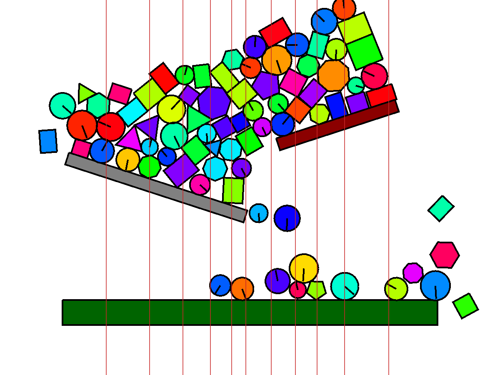

# Chapter 5: Experiments and comparisons

[Chapter 4](04-converting-to-boc.md) made two claims it asked you to take on
faith: that equal-population vertical slabs parallelise the solver well, and that
they do so at the cost of a small, bounded loss of fidelity. This chapter pays
that debt. We look at *how* the engine is measured, what the numbers actually say,
why the slab cut beats the more obvious quadtree cut, and exactly how large the
fidelity trade-off is.

A word on the numbers up front. The benchmark streams a mix of shapes whose
placement is drawn from a **seeded** generator, so the whole sweep is
reproducible: with `--seed 0 --runs 5` each of the five runs uses a different but
deterministic seed (0 through 4), so the runs genuinely differ — different piles —
yet rerunning the sweep reproduces them exactly. Every figure below is a mean over
those five runs with one standard deviation. It is still best read as a *trend*
rather than a contract: timing depends on the machine, and the standard deviations
are not small. All numbers here were captured on one specific machine and build;
the provenance is recorded in a footnote.[^bench] The two benchmark drivers live
in [`bench/drop_box.py`](../../bench/drop_box.py) and
[`bench/stack_stability.py`](../../bench/stack_stability.py).

## What we actually measure

A physics engine can be wrong in two directions, and a single "is it fast?"
number hides both. So the benchmarks track three quantities at once:

- **Cost** — wall-clock milliseconds per frame, the thing parallelism is meant to
  cut.
- **Kinetic energy** — the total translational and rotational energy in the
  scene. A correct solver lets a settling pile *lose* energy to its contacts; an
  unstable one pumps energy in and the pile jitters or explodes. The curve should
  rise while shapes are still falling, then collapse toward zero as the pile comes
  to rest.
- **Penetration depth** — the total overlap across all contacts. This is the
  direct measure of solver quality: bodies should *just* touch, so the number
  should stay small and bounded, never grow.

The drop-box probe is deliberately dynamic. Rather than releasing one clump, it
**streams** circles and polygons into an open box over the whole run, so the scene
passes through distinct regimes — scattered singletons, then several separate
piles, then one merged pile. That progression is what exercises the collision
*islands* the parallel solver fans out across workers, and it is why cost is
reported per-frame rather than as one summary number: the interesting behaviour is
how each quantity *evolves*.

For questions that need a repeatable answer, `stack_stability.py` builds a
deterministic column or pyramid of boxes — no random spawns — and measures how far
the bottom box sinks, the residual penetration at rest, how far the stack leans or
drifts, and the leftover jitter. Because it is fully reproducible, it is the right
tool for catching a regression that the noisy drop-box trend would hide.

## The serial baseline

Running the drop-box scene on one thread (80 shapes, 300 frames, friction,
quadtree broad phase) gives the reference every parallel result is judged
against:

| Frame | ms/frame | Kinetic energy | Penetration |
|------:|---------:|---------------:|------------:|
|    30 |   0.18 ± 0.06 |     129.73 ± 7.82 |  2.00 ± 0.00 |
|    90 |   0.76 ± 0.15 |    3065.92 ± 140.69 |  2.00 ± 0.00 |
|   150 |   1.50 ± 0.09 |    6489.65 ± 293.70 |  2.00 ± 0.00 |
|   210 |   4.00 ± 0.35 |    5473.43 ± 402.60 |  2.02 ± 0.02 |
|   270 |   8.69 ± 0.40 |    4124.11 ± 398.76 |  2.06 ± 0.05 |
|   300 |  11.72 ± 0.70 |    1729.56 ± 104.55 |  2.03 ± 0.01 |

Mean **3.7 ms/frame** over the run. Three things to read off it. **Cost climbs
steeply** as bodies accumulate and the separate piles merge into one big island —
from a fraction of a millisecond early on to ~12 ms at the dense final frame.
**Kinetic energy peaks mid-run**, around frame 150, while shapes are still raining
in, then falls steeply as the pile sheds energy into its contacts. And
**penetration stays pinned near 2** the whole way through — the position solve
keeps overlaps in check even as the contact count explodes, never drifting past
~2.06. That last column is the golden-master behaviour the parallel path must not
break.

## The parallel result

The same scene under `--parallel --workers 8`, cut into equal-population vertical
slabs:

| Frame | ms/frame (serial) | ms/frame (8 workers) | Penetration (parallel) |
|------:|------------------:|---------------------:|-----------------------:|
|    30 |  0.18 | 0.70 ± 0.04 | 2.00 ± 0.00 |
|   150 |  1.50 | 2.71 ± 0.20 | 2.00 ± 0.00 |
|   210 |  4.00 | 4.19 ± 0.11 | 2.01 ± 0.01 |
|   270 |  8.69 | 5.00 ± 0.26 | 2.02 ± 0.02 |
|   300 | 11.72 | 6.08 ± 0.30 | 2.03 ± 0.03 |

Averaged over the run the parallel path is **3.2 ms/frame against the serial 3.7 —
a modest ~1.15x overall**, climbing to about **1.9x at the dense final frame**
(11.7 → 6.1 ms). The pattern is the important part: early frames are actually
*slower* in parallel. When the scene is a handful of scattered singletons there is
almost no independent work to fan out, and the cost of cutting the world, packing
state blocks, and scheduling behaviors is pure overhead — which is why the modest
overall figure is dominated by the long, sparse early phase. The speed-up only
appears once the scene is dense enough to keep eight workers busy — which is
exactly the regime where the serial path was hurting. **Parallelism buys the most
where it is needed most**, and costs a little where it is not.

## The live overlay versus the benchmark

The numbers above come from the headless benchmark, which times a *drained* frame:
it schedules one physics frame and then calls `quiesce`, blocking until every
worker has finished and the writeback has landed before stopping the clock. That
is an honest end-to-end measurement — the full solve is inside the timed region.

The interactive simulation deliberately does *not* work that way, and the
`--debug` overlay shows why. Run it both ways:

```bash
simulation --debug --scene open_box            # serial
simulation --debug --scene open_box --parallel # parallel, BOC workers
```

In the **serial** build the physics step runs on the main thread, synchronously,
inside the same callback that then draws the frame. One step happens per drawn
frame, so *physics and rendering are conflated*: a 12 ms step is 12 ms the main
thread cannot spend drawing, and the moment the solver gets heavy the rendered
**FPS falls in lockstep**. The overlay's `Physics` number here is exactly that
synchronous step time, measured with a stopwatch around
[`engine.step`](../../src/bocphysics/simulation.py).

In the **parallel** build the step is *scheduled* onto BOC workers living in other
sub-interpreters, and the main thread is immediately free again. This is the
advantage that BOC buys here, and it is worth stating plainly: **the physics work
is happening simultaneously with the graphics.** While eight workers grind through
the contact solve, the main thread keeps doing whatever it needs to do — clearing
the screen, rebuilding the frame's shapes, drawing labels, handling your clicks —
without waiting on a single one of them. The rendered FPS stays high even as the
physics gets heavy, because the two are no longer the same piece of work on the
same thread.

That decoupling is also why the overlay cannot time the parallel solve the way the
serial one does. A stopwatch around the main thread's per-tick work would catch
only the *dispatch* — scheduling the frame and pumping the previous one's
writeback — a misleadingly tiny number (a millisecond or two) that says nothing
about how hard the workers are labouring. It would be a mistake to read that as a
twentyfold speed-up. So the overlay reports the honest figure instead: it counts
how many physics frames actually *complete* per second and inverts that rate into
a per-frame cost. A new physics state can land at most once per scheduling cycle,
so when the solve runs long the completion rate drops and the reported `Physics`
millisecond figure rises to match — converging on the same end-to-end cost the
drained benchmark measures, rather than the dispatch time.

So the live overlay and the benchmark agree by construction: one derives the
per-frame cost from the rate at which finished frames arrive, the other measures
that same arrival directly by draining. Neither is fooled by the fact that, in the
parallel build, the expensive part is happening somewhere the main thread never
has to look.

## Two cuts, head to head

Chapter 4 argued that *how* you draw the patch boundaries decides everything. The
overlay renders make the argument visible. Both show the same settled pile; the
only difference is the partition drawn over it.


*The loose-quadtree cut carves the world into squares. Its seams run horizontally
as well as vertically, slicing straight across the load-bearing contacts of every
vertical stack.*



*The equal-population slab cut carves the world into vertical columns of equal
body count. Its seams run only vertically — with the grain of gravity — so they
sever far fewer stacked contacts.*

The consequence is measured directly in the seam graph. The quadtree cut produces
a deep, densely-connected seam graph — around **nine** colours in this scene — so
its per-sub-step critical path is nine seam-layers deep. The slab cut drops that to
**two-to-four** colours, because almost every contact a stack relies on stays
*interior* to a single slab. Shallower seams mean a shorter critical path: under
the same eight workers the slab cut averages **3.2 ms/frame** against the quadtree
cut's **4.3 ms/frame** — about **1.3x faster** — and, tellingly, its penetration
at rest holds near ~2.03 where the quadtree cut settles marginally looser at
~2.06, because each horizontal quadtree seam slices an extra load-bearing contact
out of the interior solve. The quadtree cut is still in the engine — pass `--quadtree-cut`
to select it — precisely so this comparison can be reproduced rather than
asserted.

This is the chapter's central lesson stated as a measurement: the clever scheduler
cannot rescue a decomposition that fights the problem's geometry. Gravity stacks
bodies vertically, so the cut that runs vertically wins.

## A note on the batched kernel

The colour-batched solver from [Chapter 3](03-batching.md) is an orthogonal lever:
it changes *how* a group of contacts is evaluated, not *where*. Enabling it on the
**serial** path (the module toggle `solver.use_batched_solver`, exposed as
`--batched`) does *not* speed this scene up — it runs marginally slower, **3.9
against 3.7 ms/frame**. At 80 bodies the cost is dominated by broad- and
narrow-phase collision detection, not the contact solve, so swapping the
per-contact Python loop for dense matrix kernels trades a small packing overhead
for no visible win. The pile still settles identically (penetration ~2.05 at rest
versus the scalar 2.03, the expected effect of visiting contacts in colour order
rather than apex-first). It is off by default and validated by settling-band tests
rather than the bit-exact golden master, for exactly that reordering reason. The
kernel earns its keep where a single colour holds many contacts, not at this
scale; the two levers stay orthogonal — batching changes *how* a colour is solved,
partitioning *where*.

## The fidelity trade-off, quantified

Now the honest cost. Look again at the penetration column of the parallel table:
it holds near 2 all the way to rest, just as the serial path does. At eight
sub-steps the position solve is tight enough that cutting the pile across workers
costs no measurable resting overlap — the headline fidelity worry from the impulse
era has simply closed. The remaining cost is subtler and lives in *velocity*, not
penetration.

It is not a bug to be patched away; it is a direct and predictable consequence
of the decomposition. When one settling pile is cut across several workers, its
contacts are resolved in a different *order* than the serial sweep would use —
and order is exactly what a Gauss–Seidel solve depends on. There is a specific,
documented instance: a seam's contacts are built *after* each patch has already
solved its interior, so the closing speed the seam samples for restitution sees
an already-damped interior velocity. The two paths therefore **agree at or below
the restitution gate** — the resting, stacking regime the engine is built for —
but the decomposed seam suppresses restitution *above* it.

The crucial discipline is that this gap is **measured and locked**, not hidden.
The seam-decomposition tests in
[`test/test_parallel.py`](../../test/test_parallel.py) pin the divergence on both
sides of the restitution gate, so it cannot silently widen. This is also why
the batched and parallel paths are validated against *settling-band* tests — does
the pile come to rest in the right place, within tolerance? — rather than against
the bit-exact golden master that guards the serial scalar solver. A parallel
re-ordering can never be bit-identical to the serial sweep, so demanding bit-
equality would be demanding the wrong thing; what we demand instead is that the
physics *settles correctly*.

## Where we are

The measurements back the design. The slab cut delivers a modest ~1.15x overall
and ~1.9x where the work is densest, it beats the quadtree cut by following
gravity's grain, and its one fidelity cost — restitution suppressed above the gate
at seams, with resting penetration held near 2 — is bounded, explained, and pinned
by tests.

That leaves the cost honestly on the table rather than swept under it.
[Chapter 6](06-future-work.md) takes the remaining issues seriously: what it would
take to close the seam-restitution gap, where the partitioning could be smarter,
and the other limitations a teaching engine should be candid about.

[^bench]: All benchmark figures in this chapter were captured on 2026-06-27 from
    bocphysics 0.4 (bocpy 0.13.0) on CPython 3.14.4, on an Intel Core i7-14700F
    (28 logical cores) under Linux (WSL2). Each configuration is the mean ± one
    standard deviation over five runs of
    `python bench/drop_box.py --shapes 80 --frames 300 --runs 5 --seed 0`, with
    `--parallel --workers 8`, `--quadtree-cut`, or `--batched` added for the
    corresponding rows. Because timing is hardware- and load-dependent, treat the
    millisecond columns as relative, not absolute; rerun the command above to
    regenerate them for your own machine.
