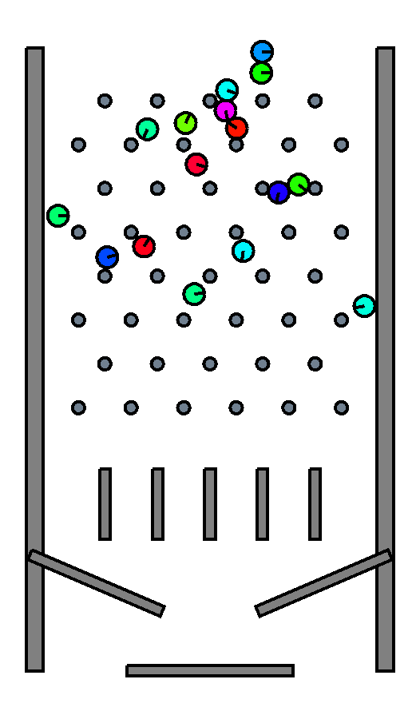

# The bocphysics tutorial



*The `pachinko` scene — hundreds of bodies raining through a peg field into
bins. It is the running example this tutorial builds toward.*

This tutorial is the long-form companion to the source code. Where the
[API reference](../api/index.rst) documents *what* each module does and the
[concept pages](../concepts/index.rst) explain the *design*, this tutorial tells
the *story*: how a small 2D rigid-body engine is built up from first principles,
and how it is then extended from a single-threaded loop into a parallel one
using [Behavior-Oriented Concurrency (BOC)](https://pypi.org/project/bocpy/)
instead of threads and locks.

It is written to be read in order. Each page builds on the last, and most
sections point at the exact file and function in the source so you can read the
prose and the code side by side.

## Who this is for

You should be comfortable with Python and have seen vectors and a little
calculus, but you do **not** need a games or physics background. Every physics
idea is introduced from scratch. The concurrency chapters assume no prior BOC
knowledge; they build the model up from a single rule.

## The journey

| # | Page | What you will learn |
|---|------|---------------------|
| 1 | [Rigid-body physics](01-rigid-body-physics.md) | What a rigid body is, how state is stored, and how a body is moved each frame by numerical integration. |
| 2 | [The serial engine](02-serial-engine.md) | The full single-threaded frame: broad phase, narrow phase, contact manifolds, and the projected Gauss–Seidel impulse solver. |
| 3 | [Batching for hardware](03-batching.md) | Why a per-contact Python loop is slow, and how a structure-of-arrays layout plus graph colouring turns the solver into dense matrix kernels. |
| 4 | [Converting to BOC](04-converting-to-boc.md) | The honest path from a serial solver to a parallel one: the approaches that failed, why they failed, and the cown-and-behavior design that shipped. |
| 5 | [Experiments and comparisons](05-experiments.md) | The partitioning strategies that were measured against each other, the numbers, and the fidelity trade-off the parallel path makes. |
| 6 | [Remaining issues](06-future-work.md) | Known limitations, the documented seam divergence, and where the engine could go next. |
| 7 | [References](07-references.md) | The papers and talks the solver and its parallelisation are built on. |

## How to run along

Everything in this tutorial can be run from a source checkout. Install the
package in editable mode and launch a scene:

```bash
pip install -e .
simulation --scene pachinko --levels 8
```

The headless benchmarks under `bench/` reproduce the performance and
convergence numbers quoted in [chapter 5](05-experiments.md).

## Figures and credits

The simulation screenshots in this tutorial — the pachinko hero shot above and
the partition overlays in [chapter 5](05-experiments.md) — are rendered
straight from the engine by `bench/tutorial_figures.py`. Rerun it from the repo
root to regenerate every figure:

```bash
python bench/tutorial_figures.py
```

The hand-drawn geometry schematics — the collision tests, contact points, and
the gravity diagram — are illustrations made for these notes.
